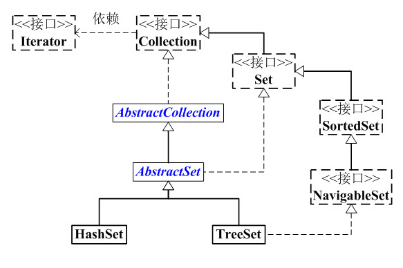
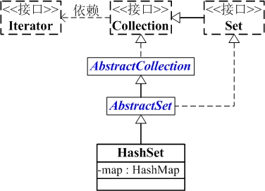

# Set架构

1. Set 是继承于Collection的接口。它是一个不允许有重复元素的集合。
2. AbstractSet 是一个抽象类，它继承于AbstractCollection，AbstractCollection实现了Set中的绝大部分函数，为Set的实现类提供了便利。
3. HastSet 和 TreeSet 是Set的两个实现类。
    HashSet依赖于HashMap，它实际上是通过HashMap实现的。HashSet中的元素是无序的。
    TreeSet依赖于TreeMap，它实际上是通过TreeMap实现的。TreeSet中的元素是有序的。

# HashSet介绍
HashSet 是一个没有重复元素的集合。
它是由HashMap实现的，不保证元素的顺序，而且HashSet允许使用 null 元素。
HashSet是非同步的。如果多个线程同时访问一个哈希 set，而其中至少一个线程修改了该 set，那么它必须 保持外部同步。这通常是通过对自然封装该 set 的对象执行同步操作来完成的。如果不存在这样的对象，则应该使用 Collections.synchronizedSet 方法来“包装” set。最好在创建时完成这一操作，以防止对该 set 进行意外的不同步访问：
`Set s = Collections.synchronizedSet(new HashSet(...));`
HashSet通过iterator()返回的迭代器是fail-fast的。

# HashSet的构造函数
```
// 默认构造函数
public HashSet() 

// 带集合的构造函数
public HashSet(Collection<? extends E> c) 

// 指定HashSet初始容量和加载因子的构造函数
public HashSet(int initialCapacity, float loadFactor) 

// 指定HashSet初始容量的构造函数
public HashSet(int initialCapacity) 

// 指定HashSet初始容量和加载因子的构造函数,dummy没有任何作用
HashSet(int initialCapacity, float loadFactor, boolean dummy)
```

# HashSet的主要API
```
boolean         add(E object)
void            clear()
Object          clone()
boolean         contains(Object object)
boolean         isEmpty()
Iterator<E>     iterator()
boolean         remove(Object object)
int             size()
```

# HashSet数据结构
HashSet的继承关系如下：
```
java.lang.Object
   ↳     java.util.AbstractCollection<E>
         ↳     java.util.AbstractSet<E>
               ↳     java.util.HashSet<E>

public class HashSet<E>
    extends AbstractSet<E>
    implements Set<E>, Cloneable, java.io.Serializable { }
```
HashSet与Map关系如下图：

从图中可以看出：
(01) HashSet继承于AbstractSet，并且实现了Set接口。
(02) HashSet的本质是一个"没有重复元素"的集合，它是通过HashMap实现的。HashSet中含有一个"HashMap类型的成员变量"map，HashSet的操作函数，实际上都是通过map实现的。

# HashSet源码解析(基于JDK1.6.0_45)
```
package java.util;

public class HashSet<E>
    extends AbstractSet<E>
    implements Set<E>, Cloneable, java.io.Serializable
{
    static final long serialVersionUID = -5024744406713321676L;

    // HashSet是通过map(HashMap对象)保存内容的
    private transient HashMap<E,Object> map;

    // PRESENT是向map中插入key-value对应的value
    // 因为HashSet中只需要用到key，而HashMap是key-value键值对；
    // 所以，向map中添加键值对时，键值对的值固定是PRESENT
    private static final Object PRESENT = new Object();

    // 默认构造函数
    public HashSet() {
        // 调用HashMap的默认构造函数，创建map
        map = new HashMap<E,Object>();
    }

    // 带集合的构造函数
    public HashSet(Collection<? extends E> c) {
        // 创建map。
        // 为什么要调用Math.max((int) (c.size()/.75f) + 1, 16)，从 (c.size()/.75f) + 1 和 16 中选择一个比较大的树呢？        
        // 首先，说明(c.size()/.75f) + 1
        //   因为从HashMap的效率(时间成本和空间成本)考虑，HashMap的加载因子是0.75。
        //   当HashMap的“阈值”(阈值=HashMap总的大小*加载因子) < “HashMap实际大小”时，
        //   就需要将HashMap的容量翻倍。
        //   所以，(c.size()/.75f) + 1 计算出来的正好是总的空间大小。
        // 接下来，说明为什么是 16 。
        //   HashMap的总的大小，必须是2的指数倍。若创建HashMap时，指定的大小不是2的指数倍；
        //   HashMap的构造函数中也会重新计算，找出比“指定大小”大的最小的2的指数倍的数。
        //   所以，这里指定为16是从性能考虑。避免重复计算。
        map = new HashMap<E,Object>(Math.max((int) (c.size()/.75f) + 1, 16));
        // 将集合(c)中的全部元素添加到HashSet中
        addAll(c);
    }

    // 指定HashSet初始容量和加载因子的构造函数
    public HashSet(int initialCapacity, float loadFactor) {
        map = new HashMap<E,Object>(initialCapacity, loadFactor);
    }

    // 指定HashSet初始容量的构造函数
    public HashSet(int initialCapacity) {
        map = new HashMap<E,Object>(initialCapacity);
    }

    HashSet(int initialCapacity, float loadFactor, boolean dummy) {
        map = new LinkedHashMap<E,Object>(initialCapacity, loadFactor);
    }

    // 返回HashSet的迭代器
    public Iterator<E> iterator() {
        // 实际上返回的是HashMap的“key集合的迭代器”
        return map.keySet().iterator();
    }

    public int size() {
        return map.size();
    }

    public boolean isEmpty() {
        return map.isEmpty();
    }

    public boolean contains(Object o) {
        return map.containsKey(o);
    }

    // 将元素(e)添加到HashSet中
    public boolean add(E e) {
        return map.put(e, PRESENT)==null;
    }

    // 删除HashSet中的元素(o)
    public boolean remove(Object o) {
        return map.remove(o)==PRESENT;
    }

    public void clear() {
        map.clear();
    }

    // 克隆一个HashSet，并返回Object对象
    public Object clone() {
        try {
            HashSet<E> newSet = (HashSet<E>) super.clone();
            newSet.map = (HashMap<E, Object>) map.clone();
            return newSet;
        } catch (CloneNotSupportedException e) {
            throw new InternalError();
        }
    }

    // java.io.Serializable的写入函数
    // 将HashSet的“总的容量，加载因子，实际容量，所有的元素”都写入到输出流中
    private void writeObject(java.io.ObjectOutputStream s)
        throws java.io.IOException {
        // Write out any hidden serialization magic
        s.defaultWriteObject();

        // Write out HashMap capacity and load factor
        s.writeInt(map.capacity());
        s.writeFloat(map.loadFactor());

        // Write out size
        s.writeInt(map.size());

        // Write out all elements in the proper order.
        for (Iterator i=map.keySet().iterator(); i.hasNext(); )
            s.writeObject(i.next());
    }


    // java.io.Serializable的读取函数
    // 将HashSet的“总的容量，加载因子，实际容量，所有的元素”依次读出
    private void readObject(java.io.ObjectInputStream s)
        throws java.io.IOException, ClassNotFoundException {
        // Read in any hidden serialization magic
        s.defaultReadObject();

        // Read in HashMap capacity and load factor and create backing HashMap
        int capacity = s.readInt();
        float loadFactor = s.readFloat();
        map = (((HashSet)this) instanceof LinkedHashSet ?
               new LinkedHashMap<E,Object>(capacity, loadFactor) :
               new HashMap<E,Object>(capacity, loadFactor));

        // Read in size
        int size = s.readInt();

        // Read in all elements in the proper order.
        for (int i=0; i<size; i++) {
            E e = (E) s.readObject();
            map.put(e, PRESENT);
        }
    }
}
```

# HashSet遍历方式
## 通过Iterator遍历HashSet
1. 根据iterator()获取HashSet的迭代器。
2. 遍历迭代器获取各个元素。
```
// 假设set是HashSet对象
for(Iterator iterator = set.iterator();
       iterator.hasNext(); ) { 
    iterator.next();
}
```

## 通过for-each遍历HashSet
1. 根据toArray()获取HashSet的元素集合对应的数组。
2. 遍历数组，获取各个元素。
```
// 假设set是HashSet对象，并且set中元素是String类型
String[] arr = (String[])set.toArray(new String[0]);
for (String str:arr)
    System.out.printf("for each : %s\n", str);
```

# HashSet示例
```
import java.util.Iterator;
import java.util.HashSet;

/*
 * @desc HashSet常用API的使用。
 *
 * @author skywang
 */
public class HashSetTest {

    public static void main(String[] args) {
        // HashSet常用API
        testHashSetAPIs() ;
    }

    /*
     * HashSet除了iterator()和add()之外的其它常用API
     */
    private static void testHashSetAPIs() {
        // 新建HashSet
        HashSet set = new HashSet();

        // 将元素添加到Set中
        set.add("a");
        set.add("b");
        set.add("c");
        set.add("d");
        set.add("e");

        // 打印HashSet的实际大小
        System.out.printf("size : %d\n", set.size());

        // 判断HashSet是否包含某个值
        System.out.printf("HashSet contains a :%s\n", set.contains("a"));
        System.out.printf("HashSet contains g :%s\n", set.contains("g"));

        // 删除HashSet中的“e”
        set.remove("e");

        // 将Set转换为数组
        String[] arr = (String[])set.toArray(new String[0]);
        for (String str:arr)
            System.out.printf("for each : %s\n", str);

        // 新建一个包含b、c、f的HashSet
        HashSet otherset = new HashSet();
        otherset.add("b");
        otherset.add("c");
        otherset.add("f");

        // 克隆一个removeset，内容和set一模一样
        HashSet removeset = (HashSet)set.clone();
        // 删除“removeset中，属于otherSet的元素”
        removeset.removeAll(otherset);
        // 打印removeset
        System.out.printf("removeset : %s\n", removeset);

        // 克隆一个retainset，内容和set一模一样
        HashSet retainset = (HashSet)set.clone();
        // 保留“retainset中，属于otherSet的元素”
        retainset.retainAll(otherset);
        // 打印retainset
        System.out.printf("retainset : %s\n", retainset);


        // 遍历HashSet
        for(Iterator iterator = set.iterator();
               iterator.hasNext(); ) 
            System.out.printf("iterator : %s\n", iterator.next());

        // 清空HashSet
        set.clear();

        // 输出HashSet是否为空
        System.out.printf("%s\n", set.isEmpty()?"set is empty":"set is not empty");
    }

}
```

