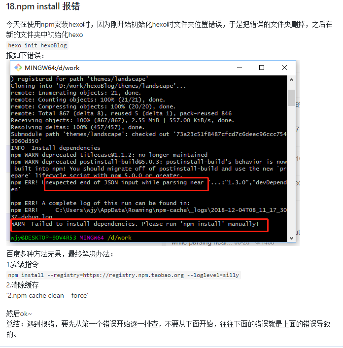

总体步骤：
1.安装Git Bash
2.安装NodeJs
3.安装hexo
4.生成SSH并添加到github
5.部署项目
6.上传到github
7.绑定个人域名
8.修改及配置主题
9.添加RSS
10.添加评论
11.写文章部分
安装git、node.js，创建github账号-创建仓库userName.github.io-将本地git通过ssh和远程github关联等等不再赘述。

## 1.安装Hexo
Hexo官网地址：
https://hexo.io/zh-cn/docs/

在git和node安装完毕后，即可使用 npm 安装 Hexo
`$ npm install -g hexo-cli`

安装完之后，初始化Hexo
```
hexo init <folder>
cd <folder>
npm install
```

上边官网给出的指令，这里就比较坑逼了。因为不知道里填什么，实际应该是：你想安装Hexo博客文件的文件夹的路径。
所以建议使用git bush cd 到想存放博客文件的父目录，然后直接使用
`hexo init 文件夹名`
指令，就完成初始化了。

遇到的坑：
因为刚开始文件夹的名字写错了，所以直接将hexo初始化的文件夹删掉了。然后再次运行初始化指令报错。解决方法：


## 2.修改配置文件
用Notepad++打开hexo安装目录下的_config.yml文件
```
deploy:
  type: git
  repo: https://github.com/ayanamiq/ayanamiq.github.io
  branch: master
```

修改上面三项内容，repo和branch是没有的，写上就好了。
坑：
1.repo是在github上创建好的仓库地址，仓库名字必须是username.github.io
2.key和后面value之间必须有空格。

然后执行如下命令
```
hexo clean
hexo generate
hexo server
```

注：hexo 3.0把服务器独立成个别模块，需要单独安装：
`npm i hexo-server`
然后打开
http://localhost:4000
就可以看到hexo的默认页面了
注：关闭页面服务就会停止

## 3.上传到github
先安装：
`npm install hexo-deployer-git --save`
这样才能将你写好的文章部署到github服务器上并让别人浏览到。

执行命令
```
hexo clean
hexo generate
hexo deploy
```

如果执行第一个指令就报：
`Usage: hexo <command>`
原因：我认为是没有生成本地服务
解决：执行指令
`$ npm install hexo-server --save`
还是不行...为啥呢？
因为指令必须在hexo的安装目录下执行！！！

注意deploy的过程中要输入你github的username和password
然后打开：
https://ayanamiq.github.io/
就可以看到刚才在本地一样访问
http://localhost:4000
一样的页面了

坑：这里在deploy的时候报错了。
`HttpRequestException encountered`
问题：Github 禁用了TLS v1.0 and v1.1，必须更新Windows的git凭证管理器
https://github.com/Microsoft/Git-Credential-Manager-for-Windows/releases/
下载并安装第一个GCMW-1.18.3.exe文件(请注意版本迭代)。
然后再deploy就可以了。

## 4.修改及配置主题
官方主题地址：
https://hexo.io/themes/

我使用的是：next
http://theme-next.iissnan.com/
官网说的非常简单明了，请自行参考。

## 5.写文章
`hexo new 'blogName'`

其他指令参考官网：
https://hexo.io/zh-cn/docs/writing

然后可以在'source/_posts'下看到新建的文章了，生成的是.md文件，推荐使用markdown编译器。
markdown编译器有一堆，比较有名的是markdownPad，但是我懒，还是直接用nodePad++好了。

1.安装MarkdownViewer++
因为7.5版本之后无论64还是32位的nodePad++都不再提供plugin manager，所以需要自行安装。
https://github.com/bruderstein/nppPluginManager/releases
下载对应自己nodePad版本的安装包，解压后得到两个文件夹，plugins和updater，
分别将文件夹中的文件粘贴到nodePad++安装路径下的plugins和updater文件夹下，
然后重启nodePad，就会在插件一栏的下面看到plugin manager，打开，找到MarkdownViewer++，
选择右下角的install，安装完之后根据提示重启。

2.导入自定义语言格式
为了设置符合markdown语言的显示效果，需要下载Markdown语言格式的xml配置文件
https://github.com/Edditoria/markdown-plus-plus
下载之后解压缩，然后打开nodePad，选择语言->自定义语言格式->导入->选择到刚才解压的文件夹的四个theme文件夹中的任意一个，
建议选择default，因为nodePad默认就是白底的，其他几个太扎眼。

## 6.添加“分类”选项
进入博客所在文件夹，打开gitbush,执行命令
`$ hexo new page categories`
成功后会提示：
`INFO Created: ~/Documents/blog/source/categories/index.md`

根据上面的路径，找到index.md这个文件，打开后默认内容是这样的：
```
---
title: 文章分类
date: 2017-05-27 13:47:40
---
```

添加type: "categories"到内容中，添加后是这样的：
```
---
title: 文章分类
date: 2019-05-27 13:47:40
type: "categories"
---
```

### 给文章添加“categories”属性
打开需要添加分类的文章，为其添加categories属性。
```
---
title: java基础
date: 2018-12-31 12:12:57
categories: - java
---
```

注意：hexo一篇文章只能属于一个分类
至此，成功给文章添加分类，点击首页的“分类”可以看到该分类下的所有文章。
当然，只有添加了categories: xxx的文章才会被收录到首页的“分类”中。

## 创建“标签”选项
进入博客所在文件夹，打开gitbush,执行命令
`$ hexo new page tags`
成功后会提示：
`INFO Created: ~/Documents/blog/source/tags/index.md`
根据上面的路径，找到index.md这个文件，打开后默认内容是这样的：
```
---
title: 标签
date: 2017-05-27 14:22:08
---
```

添加type: "tags"到内容中，添加后是这样的：
```
---
title: 文章分类
date: 2017-05-27 13:47:40
type: "tags"
---
```
保存并关闭文件。

### 给文章添加“tags”属性
打开需要添加标签的文章，为其添加tags属性。
```
---
title: java基础
date: 2017-05-26 12:12:57
categories: 
- java基础
tags:
- java
- 基础
---
```

至此，成功给文章添加分类，点击首页的“标签”可以看到该标签下的所有文章。
当然，只有添加了tags: xxx的文章才会被收录到首页的“标签”中。

细心的朋友可能已经发现，这两个的设置几乎一模一样！是的，没错，思路都是一样的。
所以我们可以打开scaffolds/post.md文件，在tages:上面加入categories:,
保存后，之后执行hexo new 文章名命令生成的文件，页面里就有categories:项了。

scaffolds目录下，是新建页面的模板，执行新建命令时，是根据这里的模板页来完成的，所以可以在这里根据你自己的需求添加一些默认值。

## 添加about标签
`hexo new page 'about'`
在安装位置下的source文件夹下会有about文件夹，打开，编辑里面的index.md

## 引用图片
总体来说有两种引用方式：
1.公网图片地址
2.将图片引入项目内，使用相对路径

公网地址总是不可靠的，又没有自己的服务器，只能传到别的地方，这样链接总有可能会失效。
可行的办法：
1.把图片上传到新浪图床
2.在github新建一个res，专门用来存放图片。

将图片引入项目内
1.修改项目的_config.yml，post_asset_folder:true
Hexo 提供了一种更方便管理 Asset 的设定：post_asset_folder
当您设置post_asset_folder为true参数后，在建立文件时，Hexo会自动建立一个与文章同名的文件夹，您可以把与该文章相关的所有资源都放到那个文件夹，如此一来，您便可以更方便的使用资源。

2.在hexo的目录下执行
`npm install https://github.com/CodeFalling/hexo-asset-image --save`
需要等待一段时间

3.完成安装后用hexo新建文章的时候会发现_posts目录下面会多出一个和文章名字一样的文件夹。图片就可以放在文件夹下面。结构如下：
```
本地图片测试
├── apppicker.jpg
├── logo.jpg
└── rules.jpg
本地图片测试.md
```
这样的目录结构（目录名和文章名一致），只要使用  就可以插入图片。
生成的结构为
```
public/2016/3/9/本地图片测试
├── apppicker.jpg
├── index.html
├── logo.jpg
└── rules.jpg
```

同时，生成的 html 是
``

而不是愚蠢的
``

