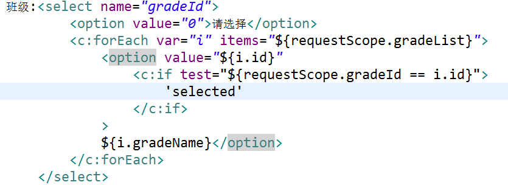
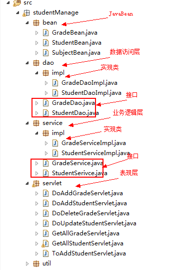

# web应用服务器
目前较为主流的Web应用服务器
Tomcat  ------  Apache软件基金会
Jboss  -------  JBOSS公司
Weblogic ------  BEA公司
Websphere -----  IBM公司
IIS  ------ 微软  支持ASP语言
Web应用服务器的主要作用是让用户可以通过浏览器（HTTP/HTTPS）方式访问你的项目。

## Tomcat目录结构
bin目录：存放tomcat启动和关闭的脚本文件
conf目录：存放tomcat各种配置文件
lib目录：存放tomcat的jar文件
logs目录：存放tomcat日志文件
work目录：tomcat运行时产生的工作文件
temp目录：存放临时文件
**webapps目录：主要的发布目录，放置javaWeb程序**
发布：
Eclipse:右键项目，export，选定路径生成war包，放入Tomcat的webapps目录下
idea：maven-package

## tomcat启动与停止
启动服务：双击tomcat   bin目录下的startup.bat
最后一行显示：server startup in 1234 ms
证明启动成功
打开浏览器，输入localhost:8080，可以看到tomcat默认页面
停止服务：双击tomcat   bin目录下的shutdown.bat 或直接闭窗口

## Tomcat端口设置
conf目录下server.xml文件进行修改
在server.xml中找到<Connector></Connector>标签，修改port中的端口号
注：端口范围：0--65535，其中0--1023，这些端口，一般固定分配给一些服务，
21 -- FTP服务(文件传输)
25 -- SMTP(简单邮件传输协议)
80 -- HTTP服务
135 -- RPC(远程过程调用)

动态端口范围：1024 -- 65535  ,尽量不要占用系统端口

## Tomcat启动失败常见问题
1.JAVA环境变量配置有问题为导致tomcat启动时一闪而过，启动不成功。
2.tomcat端口被其他程序占用，尝试关闭占用端口的程序或修改tomcat端口

## 访问Tomcat中的项目
IP地址:端口号/项目名字

## Web项目结构
在WEB-INF 之外，存放静态资源，可以通过浏览器访问
WEB-INF中的文件受保护，无法通过浏览器直接访问

## apache和tomcat区别
- apache支持静态页，tomcat支持动态的，比如servlet等， 一般使用apache+tomcat的话，apache只是作为一个转发，对jsp的处理是由tomcat来处理的。
apache可以支持php\cgi\perl,但是要使用java的话，你需要tomcat在apache后台支撑，将java请求由apache转发给tomcat处理。
apache是web服务器,Tomcat是应用（java）服务器，它只是一个servlet(jsp也翻译成servlet)容器，可以认为是apache的扩展，但是可以独立于apache运行。  

这两个有以下几点可以比较的：
	1、两者都是apache组织开发的 
	2、两者都有HTTP服务的功能 
	3、两者都是免费的  
	
不同点：
- Apache是专门用了提供HTTP服务的，以及相关配置的（例如虚拟主机、URL转发等等），Tomcat是Apache组织在符合J2EE的JSP、Servlet标准下开发的一个JSP服务器     
- apache是一个web服务器环境程序,启用他可以作为web服务器使用,不过只支持静态网页,如(asp,php,cgi,jsp)等动态网页的就不行，如果要在apache环境下运行jsp的话就需要一个解释器来执行jsp网页，
而这个jsp解释器就是tomcat, 为什么还要JDK呢？因为jsp需要连接数据库的话，就要jdk来提供连接数据库的驱程，所以要运行jsp的web服务器平台就需要apache+tomcat+jdk。
整合的好处是： 如果客户端请求的是静态页面，则只需要Apache服务器响应请求 如果客户端请求动态页面，则是Tomcat服务器响应请求，因为jsp是服务器端解释代码的，这样整合就可以减少Tomcat的服务开销。
- apache:侧重于http server
	tomcat:侧重于servlet引擎，如果以standalone方式运行，功能上与apache等效，支持JSP，但对静态网页不太理想；  
	apache是web服务器，tomcat是应用（java）服务器，它只是一个servlet(jsp也翻译成servlet)容器，可以认为是apache的扩展，但是可以独立于apache运行。  
	换句话说，apache是一辆卡车，上面可以装一些东西如html等。但是不能装水，要装水必须要有容器（桶tomcat），而这个桶也可以不放在卡车上。

# JSP
## JSP语法
JSP中可以写JAVA代码
```
<body>
<% 
System.out.print("Hello world");
%>
</body>
```
<%  JAVA代码  %>
**单个脚本片段可以是不完整的，但是多个脚本片段整合的结果必须是完整的JAVA语句**
JSP脚本表达式
`<h1><%=userName%></h1>`
`<%=  变量名 %>`

## JSP对象作用域
作用域：即"信息共享的范围"，就是说一个信息能够在多大范围内有效。
从大到小排列
1.Application 在所有应用程序中有效
例：如将一个变量保存到application中，所有人通过浏览器都可以看到该变量的值（信息是共享的）。

2.Session 在当前会话有效
会话：打开浏览器访问某网站，等于跟目标网站开启了一个会话，将浏览器关闭，则此次会话结束。
例：现有一个用户如将一个变量保存到session中，当前用户打开浏览器可以看到该变量的值，其他用户看不到，关闭浏览器后则会话结束。

3.Request 在当前请求有效
请求：每一次操作网站，比如：查询，提交，购买 ……
请求查询，请求提交，请求购买……

4.Page 当前页面有效

## JSP内置对象
Web服务器(Tomcat)启动后创建的一组对象，不需要使用new关键字直接可以使用该对象。
内置对象只存在于JSP中
JSP九大内置对象
session,request,response,out,page,application,pageContext,exception,config

1.Session对象
```
类型：Javax.servlet.http.HttpSession
作用域：Session
表示一个会话，用来保存用户信息，以便跟踪每个用户的状态。
常用方法：
session.getId(); 
取得Session的ID号，ID由Tomcat自动分配。
session.setAttribute(key,object); 
向Session中设置一个属性。
参数 key---键、标识，可理解为该属性的名字，
Session中相同的key所对应的值会覆盖。
参数 object---该属性的值，可以是任意类型的JAVA对象。
session.getAttribute(key);
获取Session中的一个属性。
参数key --- 键、标识、可理解为属性名字。
通过session.setAttribute方法所设置的key来获取对应的值。
	  session.removeAttribute(key);
			删除Session中的一个属性。
参数key --- 键、标识、可理解为属性名字。
通过session.setAttribute方法所设置的key来删除一个属性
```

2.Request对象
```
类型：javax.servlet.http.HttpServletRequest
作用域：Request
request对象代表了客户端的请求信息，主要用于接受通过HTTP协议传送到服务器的数据。（包括头信息、系统信息、请求方式以及请求参数等）。request对 象的作用域为一次请求。
常用方法：
request.getParameter(key);
		获取表单提交数据（参数）。
		参数key --- 参数名字。
通过key获取页面传递的参数，key与HTML标签的name对应，如想将页面的数据当做参数标题至后台，需要指定元素的name属性。
request.getParameterValues(key);
		与request.getParameter方法用法一致。
		返回值是数组，一般用于获取复选框checkbox的值。
	  request.setAttribute(key,object);
			向Request中设置一个属性。
			参数同session.setAttribute方法。
request.gettAttribute(key);
		获取Request中的一个属性。
		参数同session.getAttribute方法。
request.getRequestDispatcher("list.jsp").forward(request,response);
	用转发方式跳转到目标路径。
   参数---JSP页面或另一个Servlet。
	固定参数request,response。
request.setCharacterEncoding("UTF-8");
	设置请求的编码方式。
	参数---编码格式UTF-8/GBK/GB2312 ……
```

3.Response对象
```
类型：Javax.servlet.http. HttpServletResponse
作用域：Page
response 代表的是对客户端的响应，主要是将JSP容器处理过的对象传回到客户端。
常用方法：
response.sendRedirect("页面");
通过重定向方式跳转到目标路径。
参数 --- JSP页面或另一个Servlet。
response.setCharacterEncoding("gbk");
设置响应编码格式。
参数---编码格式UTF-8/GBK/GB2312 ……。
```

4.Out对象
```
类型:javax.servlet.jsp.jspWriter
作用域:Page
Out对象是一个输出流，用来向客户端输出数据。
常用方法：
out.print();
向浏览器输出各类型的数据。
类似System.out.print()方法;
out.close();
关闭流。
```

5.Page对象
类型:java.lang.Object
作用域：Page

6.Application对象
```
类型：javax.servlet.ServletContext
作用域：application
application 对象可将信息保存在服务器中，直到服务器关闭，否则application对象中保存的信息会在整个应用中都有效。与session对象相比，application对象生命周期更长，类似于系统的“全局变量”。
服务器启动后就产生了这个Application对象，当客户再所访问的网站的各个页面之间浏览时，这个Application对象都是同一个，直到服务器关闭。但是与Session对象不同的时，所有客户的Application对象都时同一个，即所有客户共享这个内置的Application对象。

```

7. pageContext对象
```
 类型: javax.servlet.jsp.PageContext
作用域：Page
本JSP的页面上下文。
上下文的理解：上下文可以联系到当前页面所有的信息。
通过PageContext上下文对象获取当前页面的其他内置对象。
pageContext.getRequest();获取Request对象。
pageContext.getResponse();获取Response对象。
```

8.exception对象
 类型：java.lang.Exception
作用域：Page
本JSP页面的异常对象

9.config对象
 类型: javax.servlet.ServletConfig
 作用域：Page
 代表配置对象。

10.总结
```
request 请求对象   作用域 Request
response 响应对象  作用域 Page
pageContext 页面上下文对象  作用域 Page
session  会话对象  作用域 Session
application  应用程序对象  作用域 Application
out  输出对象   作用域 Page
config   配置对象  作用域 Page
page 页面对象   作用域 Page
exception  异常对象  作用域 page
```

## JSP基本指令
1.指令用于对JSP一些设置
`指令语法  <%@  指令名  属性名 = 值  %>`
一个指令作用于整个JSP文件
1.1 page指令
`<%@ page import="jsp_test.deleteUser"%>`
1.2 include指令
附加一个页面
`<%@ include file="doLogin.jsp" %>`
1.3 tablib指令
`<%@ prefix="c" uri="http://java.sun.com/jsp/jstl/core" %>`

## JSP动作
略
违反了前后端分离的思想

## <jsp:include>与<%@include%>区别
1.<%@include%>嵌入代码，先合并后编译，把代码原封不动的附加过来
如页面a.jsp中 有变量 stuName，b.jsp 中同样存在变量 stuName
使用<%@include%> 将报错，变量名重复

2.<jsp:include>嵌入执行后的内容。
先编译后合并，合并的是编译后的结果。
上述情况如使用<jsp:include>则不会报错。

# Servlet生命周期
1.装载并创建该Servlet的一个实例对象(实例化)
2.调用Servlet实例对象的init()方法(初始化)
3.创建了一个用于封装HTTP请求消息的HttpServletRequest对象和一个代表HTTP响应消息的
HttpServletResponse对象，然后调用servlet的service()方法，
并将请求和相应对象作为参数传递进去(服务)
4.Web应用程序在被停止或重新启动之前，Servlet引擎将卸载Servlet，并在卸载之前调用Servlet的
destroy()方法)  (销毁)

实例化 --- 初始化 ---  服务 ---  销毁

# 转发和重定向的区别
重定向(redirect)
1.发送请求
2.服务器响应请求，返回给浏览器一个新的地址和响应
3.浏览器根据响应码，判定该响应为重定向，自动发送一个新的请求给服务器，请求地址为之前返回的地址
4.服务器响应请求给浏览器

转发(forward):
1.发送请求
2.服务器进行请求的重新设置，例如通过request.setAttribute
3.浏览器根据转发的地址，获取该地址的网页
4.服务器响应请求给浏览器

区别：
1.redirect改变浏览器地址，forward浏览器网址不变
2.redirect产生了两次请求，forward只产生一次请求
3.redirect网址可以是任意网站，forward必须是本站的网址
4.redirect:之前request中的变量全部失效，并进入一个新的request作用域
forward:之前request中的变量不会失效，就像把两个页面拼到了一起

1.有值没值
2.本站外站
3.变不变址
4.一次两次

# JavaBean
特征：
1.提供了一个默认的无参构造函数
2.需要被序列化并且实现了Serializanle接口
3.可能有一系列可读写属性
4.可能有一系列的"getter"或"setter"方法。

简单来说，JavaBean也是一个普通的JAVA类。
项目中，每一张数据表对应一个JavaBean, JavaBean中的属性、属性类型与数据表的字段和数据类型对应。
可将一个JavaBean对象看成一条数据。
单条数据用一个JavaBean对象接收。
多条数据用List< JavaBean > 对象接收。
通过JavaBean可实现数据表之间的关系。
使用JavaBean可保证开发时的效率以及数据类型的检查。

# JSTL标签及EL表达式
## JSTL标签：
JSP标准标签库（JSTL）是一个JSP标签集合，它封装了JSP应用的通用核心功能。JSP标准标签库（JSTL）是一个JSP标签集合，它封装了JSP应用的通用核心功能。
使用方法：
1.导入JAR包，jstl-1.2.jar。
2.在JSP页面中导入标签库
<% tablib  prefix="c" uri="http://java.sun.com/jsp/jstl/core" %>

## EL表达式
语法结构:
`${expression}`
可获取Page,Request,Session,Application作用域中的对象，根据setAttribute的key来获取。
获取request中的student对象：`${requestScope.student}`
获取request中的student对象的name属性：`${requestScope.student.name}`

常用的JSTL标签：
JSTL可嵌套EL表达式：
### <c:if>
```
<c:if test="${requestScope.student != null}"
    <p>request中的student对象不为空</p>
</c:if>
```
注意：只有if标签，没有else标签

### <c:choose>
<c:choose>本身只当做<c:when>和<c:otherwise>的父标签，不能单独使用。配套使用替代if/else结构
```
<c:choose>
    <c:when test="${requestScope.student != null}">
        <p>request中的student对象不为空</p>
    </c:when>
    <c:otherwise>
        <p>request中的student对象为空</p>
    </c:otherwise>
</c:choose>
```
### <c:forEach>
用于遍历集合中的数据
<c:forEach var="i" items="${requestScope.list}">
    <p>${i.name}</p>
</c:forEach>
假设后台代码 request.setAttribute(“list”,list);
那么每一次循环标识“i”都代表了一个student对象。
通过“i” 可以获取到student中的所有属性。

## jstl实战
### 判断选中了哪一个下拉选的值
方法1：

方法2：


### 单选框


### 复选框
需要引入另外一个标签库：
`<%@ taglib prefix="fn" uri="http://java.sun.com/jsp/jstl/functions" %>`
调用方法`fn.contains`判断是否包含


# MVC模式 
MVC全名是Model View Controller
模型(model)－视图(view)－控制器(controller)
MVC是一个框架模式，它强制性的使应用程序的输入、处理和输出分开。使用MVC应用程序被分成三个核心部件：模型、视图、控制器。它们各自处理自己的任务。最典型的MVC就是JSP + servlet + javabean的模式。
MVC工作原理
用户发送一个请求到控制器，控制器处理业务逻辑，如需要与数据库交互会用到相应的模型，业务逻辑处理完毕后返回一个结果（视图）给用户。

# 项目开发三层模式
数据访问层（最下层）
		主要负责数据库的访问，与数据进行交互，增删改查代码。
	业务逻辑层（中间层）
		处理个性化业务逻辑代码。
	表现层（最上层）
离用户最近。用于显示数据和接收用户输入的数据，为用户提供一种交互式操作的界面。 　
	优点：
		1.开发人员可以只关注结构中的某一层。
		2.可以很容易的用新的实现来替换原有层次的实现。
		3.可以降低层与层之间的依赖。
		4. 有利于标准化。
		5. 利于各层逻辑的复用。
	缺点：
1. 降低了系统的性能。这是不言而喻的。如果不采用分层式结构，很多业务可以直接造访数据库，以此获取相应的数据，如今却必须通过中间层来完成。
2. 有时会导致级联的修改。这种修改尤其体现在自上而下的方向。如果在表示层中需要增加一个功能，为保证其设计符合分层式结构，可能需要在相应的业务逻辑层和数据访问层中都增加相应的代码。


注意：代码不可跨层调用。
与MVC模式不用，MVC属于程序语言的设计模式。三层模式为实际开发模式。

# 分页
分页所需条件
1.每页显示数（自定义）
2.当前页面，初识为1，第一页（通过页面JSP传递得到）
3.总页数（计算得到）
	总页数 = 总条数/每页显示数
	如果总条数/每页显示数为整数 那么页数刚好
	如果不为整数 需要页数+1  如果总条数/每页显示 +1
4.总条数（查询数据库得到）
5.获取数据起始位置，用作LIMIT 关键字的第一个参数（计算得到）
公式 ： （ 当前页数 - 1 ） *  每页显示数
