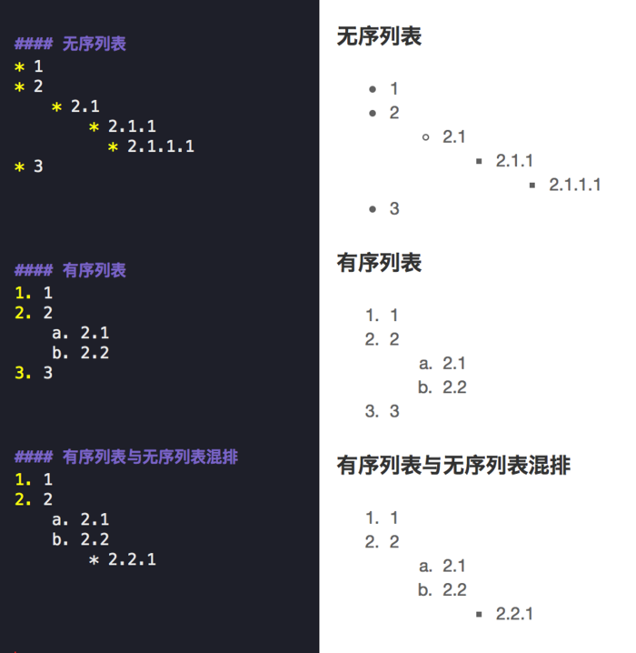
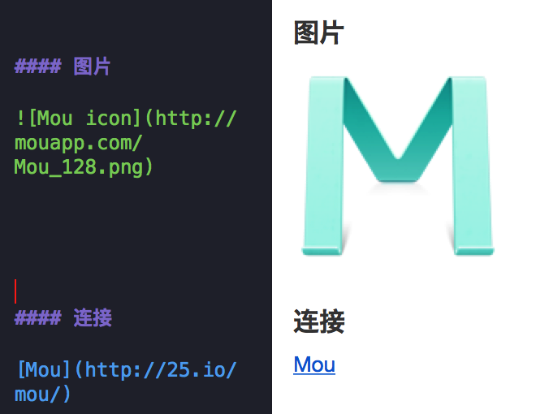
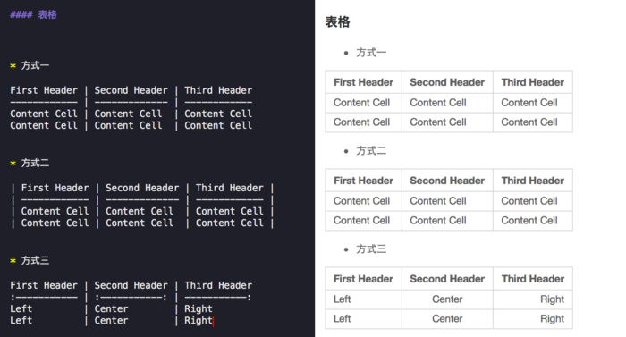

# 标题
总共六级标题，建议在井号后加一个空格，这是最标准的 Markdown 语法。
# 一级标题
## 二级标题
### 三级标题
#### 四级标题
##### 五级标题
###### 六级标题
和h1到h6一样，字体由大到小

# 文本样式
- 加粗
字体两边各加两个星号 ** 快捷键ctrl+b

- 斜体
字体两边各加  __ 快捷键 ctrl+i

- 删除线
各加两个波浪线。  快捷键：ctrl+u ,和uc浏览器有热键冲突


- 换行
换行：只需在行末加两个空格键和一个回车键即可换行

- 分段
分段：段落之间空一行即可。

# 列表
- 无序列表
使用星号(*)、加号(+)或是减号(-)作为列表标记，注意符号后边一定要跟一个空格。
在星号前加两个空格键或者一个tab键就可以产生一个子列表。

- 有序列表
在文本前加字母或数字即可生成一个有序列表。
注意，当你第一个序号使用什么作为标记的，那么同级别的列表就会自动使用其作为标记。


# 引用
文本前加大于号  >  即可


# 图片和连接
- 图片
`：感叹号+中括号[图片描述]+小括号(连接地址)`

- 连接
`[文本内容](连接地址)：中括号+小括号`
图片比连接多一个感叹号


# 水平线
三个减号`---`或者三个星号`***`都可以画出一条水平分割线，需要和上边的内容空出一行

---

# 代码段
点：指的是键盘tab上边那个小点
`这是一行代码，用两点包裹`

```
这是一段代码，
上下分别用三个点包裹
```

在围栏式代码块中，你可以指定一个可选的语言标识符，然后我们就可以为它启用语法着色了。方法是在第一排的三个点右边加上想要的语言标识符。
目前已知可用：
java
js
javascript
sql
xml


# 表格
在 Markdown下制作表格，是非常非常麻烦的一件事，必须画出来才行。

我这么懒，肯定不会画的...

# 注释
`<!-- 一段注释 -->`
和html里的注释是一样，注释是给自己看的，预览时也不会出现，当然发布出去别人也不会看见。

# 制表
记录一种最简单的制表方法

title1 | title1
-- | --
content1 | content2
content3 | content4
content5 | content6

```
title1 | title1
-- | --
content1 | content2
content3 | content4
content5 | content6
```

表头必须和内容间隔一行，表头和内容之间由
-- | --
分隔，一个 -- 表示一个表头，中间由竖线分隔，不需要加空格。如果表头有四个，
-- | -- | -- | --
这样就可以了。
内容由竖线分隔。