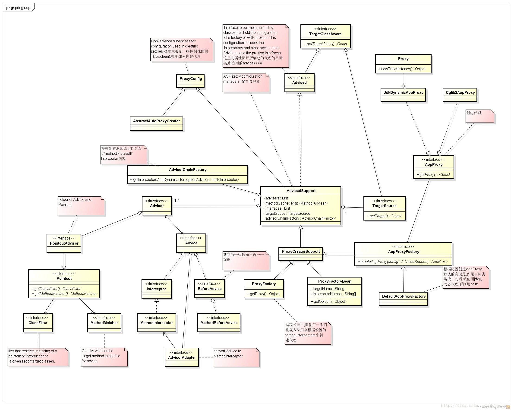
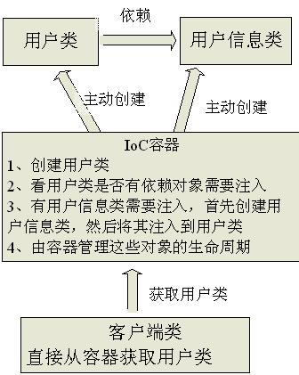

# AOP概述
AOP(面向切面编程)可以说是OOP(面向对象编程)的补充和完善。
OOP引入封装、继承和多态性等概念来建立一种对象层次结构，用以模拟公共行为的一个集合。
当我们需要为分散的对象引入公共行为的时候，OOP则显得无能为力。
也就是说，OOP允许你定义从上到下的关系，但并不适合定义从左到右的关系，例如日志功能。

日志代码往往水平地散布在所有对象层次中，而与它所散布到的对象的核心功能毫无关系。
对于其他类型的代码，如安全性、异常处理和透明的持续性也是如此。
这种散布在各处的无关的代码被称为横切（cross-cutting）代码，在OOP设计中，它导致了大量代码的重复，而不利于各个模块的重用。

而AOP技术则恰恰相反，它利用一种称为“横切”的技术，剖解开封装的对象内部，并将那些影响了多个类的公共行为封装到一个可重用模块，并将其名为“Aspect”，即方面。
所谓“方面”，简单地说，就是将那些与业务无关，却为业务模块所共同调用的逻辑或责任封装起来，便于减少系统的重复代码，降低模块间的耦合度，并有利于未来的可操作性和可维护性。

AOP代表的是一个横向的关系，如果说“对象”是一个空心的圆柱体，其中封装的是对象的属性和行为；那么面向方面编程的方法，就仿佛一把利刃，将这些空心圆柱体剖开，以获得其内部的消息。而剖开的切面，也就是所谓的“方面”了。然后它又以巧夺天功的妙手将这些剖开的切面复原，不留痕迹。

使用“横切”技术，AOP把软件系统分为两个部分：核心关注点和横切关注点。
业务处理的主要流程是核心关注点，与之关系不大的部分是横切关注点。
横切关注点的一个特点是，他们经常发生在核心关注点的多处，而各处都基本相似。比如权限认证、日志、事务处理。
Aop 的作用在于分离系统中的各种关注点，将核心关注点和横切关注点分离开来。

## AOP的实现方式
- 采用动态代理技术，利用截取消息的方式，对该消息进行装饰，以取代原有对象行为的执行。
- 采用静态织入的方式，引入特定的语法创建“方面”，从而使得编译器可以在编译期间织入有关“方面”的代码。

## 使用场景
- Authentication 权限
- Caching 缓存
- Context passing 内容传递
- Error handling 错误处理
- Lazy loading　懒加载
- Debugging　　调试
- logging, tracing, profiling and monitoring　记录跟踪　优化　校准
- Performance optimization　性能优化
- Persistence　　持久化
- Resource pooling　资源池
- Synchronization　同步

## AOP相关概念
方面（Aspect）：一个关注点的模块化，这个关注点实现可能另外横切多个对象。
事务管理是J2EE应用中一个很好的横切关注点例子。方面用Spring的 Advisor或拦截器实现。

连接点（Joinpoint）: 程序执行过程中明确的点，如方法的调用或特定的异常被抛出。

 通知（Advice）: 在特定的连接点，AOP框架执行的动作。各种类型的通知包括“around”、“before”和“throws”通知。通知类型将在下面讨论。许多AOP框架包括Spring都是以拦截器做通知模型，维护一个“围绕”连接点的拦截器链。Spring中定义了四个advice: BeforeAdvice, AfterAdvice, ThrowAdvice和DynamicIntroductionAdvice

 切入点（Pointcut）: 指定一个通知将被引发的一系列连接点的集合。AOP框架必须允许开发者指定切入点：例如，使用正则表达式。 Spring定义了Pointcut接口，用来组合MethodMatcher和ClassFilter，可以通过名字很清楚的理解， MethodMatcher是用来检查目标类的方法是否可以被应用此通知，而ClassFilter是用来检查Pointcut是否应该应用到目标类上

 引入（Introduction）: 添加方法或字段到被通知的类。 Spring允许引入新的接口到任何被通知的对象。例如，你可以使用一个引入使任何对象实现 IsModified接口，来简化缓存。Spring中要使用Introduction, 可有通过DelegatingIntroductionInterceptor来实现通知，通过DefaultIntroductionAdvisor来配置Advice和代理类要实现的接口

 目标对象（Target Object）: 包含连接点的对象。也被称作被通知或被代理对象。POJO

 AOP代理（AOP Proxy）: AOP框架创建的对象，包含通知。 在Spring中，AOP代理可以是JDK动态代理或者CGLIB代理。

 织入（Weaving）: 组装方面来创建一个被通知对象。这可以在编译时完成（例如使用AspectJ编译器），也可以在运行时完成。Spring和其他纯Java AOP框架一样，在运行时完成织入。

## StringAOP组件


## 如何使用AOP
可以通过配置文件或者编程的方式来使用SpringAOP。配置可以通过xml文件来进行，大概有四种方式：
-  配置ProxyFactoryBean，显式地设置advisors, advice, target等
- 配置AutoProxyCreator，这种方式下，还是如以前一样使用定义的bean，但是从容器中获得的其实已经是代理对象
- 通过<aop:config>来配置
- 通过<aop: aspectj-autoproxy>来配置，使用AspectJ的注解来标识通知及切入点
也可以直接使用ProxyFactory来以编程的方式使用Spring AOP，通过ProxyFactory提供的方法可以设置target对象, advisor等相关配置，最终通过 getProxy()方法来获取代理对象

## SpringAOP代理对象的生成
Spring提供了两种方式来生成代理对象：JDK_Proxy和Cglib，具体使用哪种方式生成由AopProxyFactory根据AdvisedSupport对象的配置来决定。默认的策略是如果目标类是接口，则使用JDK动态代理技术，否则使用Cglib来生成代理。下面我们来研究一下Spring如何使用JDK来生成代理对象，具体的生成代码放在JdkDynamicAopProxy这个类中，直接上相关码：
```
/**
    * <ol>
    * <li>获取代理类要实现的接口,除了Advised对象中配置的,还会加上SpringProxy, Advised(opaque=false)
    * <li>检查上面得到的接口中有没有定义 equals或者hashcode的接口
    * <li>调用Proxy.newProxyInstance创建代理对象
    * </ol>
    */
   public Object getProxy(ClassLoader classLoader) {
       if (logger.isDebugEnabled()) {
           logger.debug("Creating JDK dynamic proxy: target source is " +this.advised.getTargetSource());
       }
       Class[] proxiedInterfaces =AopProxyUtils.completeProxiedInterfaces(this.advised);
       findDefinedEqualsAndHashCodeMethods(proxiedInterfaces);
       return Proxy.newProxyInstance(classLoader, proxiedInterfaces, this);
}
```
那这个其实很明了，注释上我也已经写清楚了，不再赘述。下面的问题是，代理对象生成了，那切面是如何织入的？
我们知道InvocationHandler是JDK动态代理的核心，生成的代理对象的方法调用都会委托到InvocationHandler.invoke()方法。而通过JdkDynamicAopProxy的签名我们可以看到这个类其实也实现了InvocationHandler，下面我们就通过分析这个类中实现的invoke()方法来具体看下SpringAOP是如何织入切面的。
```
publicObject invoke(Object proxy, Method method, Object[] args) throwsThrowable {
       MethodInvocation invocation = null;
       Object oldProxy = null;
       boolean setProxyContext = false;
 
       TargetSource targetSource = this.advised.targetSource;
       Class targetClass = null;
       Object target = null;
 
       try {
           //eqauls()方法，具目标对象未实现此方法
           if (!this.equalsDefined && AopUtils.isEqualsMethod(method)){
                return (equals(args[0])? Boolean.TRUE : Boolean.FALSE);
           }
 
           //hashCode()方法，具目标对象未实现此方法
           if (!this.hashCodeDefined && AopUtils.isHashCodeMethod(method)){
                return newInteger(hashCode());
           }
 
           //Advised接口或者其父接口中定义的方法,直接反射调用,不应用通知
           if (!this.advised.opaque &&method.getDeclaringClass().isInterface()
                    &&method.getDeclaringClass().isAssignableFrom(Advised.class)) {
                // Service invocations onProxyConfig with the proxy config...
                return AopUtils.invokeJoinpointUsingReflection(this.advised,method, args);
           }
 
           Object retVal = null;
 
           if (this.advised.exposeProxy) {
                // Make invocation available ifnecessary.
                oldProxy = AopContext.setCurrentProxy(proxy);
                setProxyContext = true;
           }
 
           //获得目标对象的类
           target = targetSource.getTarget();
           if (target != null) {
                targetClass = target.getClass();
           }
 
           //获取可以应用到此方法上的Interceptor列表
           List chain = this.advised.getInterceptorsAndDynamicInterceptionAdvice(method,targetClass);
 
           //如果没有可以应用到此方法的通知(Interceptor)，此直接反射调用 method.invoke(target, args)
           if (chain.isEmpty()) {
                retVal = AopUtils.invokeJoinpointUsingReflection(target,method, args);
           } else {
                //创建MethodInvocation
                invocation = newReflectiveMethodInvocation(proxy, target, method, args, targetClass, chain);
                retVal = invocation.proceed();
           }
 
           // Massage return value if necessary.
           if (retVal != null && retVal == target &&method.getReturnType().isInstance(proxy)
                    &&!RawTargetAccess.class.isAssignableFrom(method.getDeclaringClass())) {
                // Special case: it returned"this" and the return type of the method
                // is type-compatible. Notethat we can't help if the target sets
                // a reference to itself inanother returned object.
                retVal = proxy;
           }
           return retVal;
       } finally {
           if (target != null && !targetSource.isStatic()) {
                // Must have come fromTargetSource.
               targetSource.releaseTarget(target);
           }
           if (setProxyContext) {
                // Restore old proxy.
                AopContext.setCurrentProxy(oldProxy);
           }
       }
    }
```
主流程可以简述为：获取可以应用到此方法上的通知链(Interceptor Chain)，如果有，则应用通知，并执行joinpoint； 如果没有，则直接反射执行joinpoint。而这里的关键是通知链是如何获取的以及它又是如何执行的，下面逐一分析下。
首先，从上面的代码可以看到，通知链是通过
`Advised.getInterceptorsAndDynamicInterceptionAdvice()`这个方法来获取的，我们来看下这个方法的实现：
```
public List<Object>getInterceptorsAndDynamicInterceptionAdvice(Method method, Class targetClass) {
           MethodCacheKeycacheKey = new MethodCacheKey(method);
           List<Object>cached = this.methodCache.get(cacheKey);
           if(cached == null) {
                    cached= this.advisorChainFactory.getInterceptorsAndDynamicInterceptionAdvice(
                                       this,method, targetClass);
                    this.methodCache.put(cacheKey,cached);  
           }  
           returncached;  
 }
```

可以看到实际的获取工作其实是由
`AdvisorChainFactory. getInterceptorsAndDynamicInterceptionAdvice()`这个方法来完成的，获取到的结果会被缓存。下面来分析下这个方法的实现：
```
/**
    * 从提供的配置实例config中获取advisor列表,遍历处理这些advisor.如果是IntroductionAdvisor,
    * 则判断此Advisor能否应用到目标类targetClass上.如果是PointcutAdvisor,则判断
    * 此Advisor能否应用到目标方法method上.将满足条件的Advisor通过AdvisorAdaptor转化成Interceptor列表返回.
    */
    publicList getInterceptorsAndDynamicInterceptionAdvice(Advised config, Methodmethod, Class targetClass) {
       // This is somewhat tricky... we have to process introductions first,
       // but we need to preserve order in the ultimate list.
       List interceptorList = new ArrayList(config.getAdvisors().length);
 
       //查看是否包含IntroductionAdvisor
       boolean hasIntroductions = hasMatchingIntroductions(config,targetClass);
 
       //这里实际上注册一系列AdvisorAdapter,用于将Advisor转化成MethodInterceptor
       AdvisorAdapterRegistry registry = GlobalAdvisorAdapterRegistry.getInstance();
 
       Advisor[] advisors = config.getAdvisors();
        for (int i = 0; i <advisors.length; i++) {
           Advisor advisor = advisors[i];
           if (advisor instanceof PointcutAdvisor) {
                // Add it conditionally.
                PointcutAdvisor pointcutAdvisor= (PointcutAdvisor) advisor;
                if(config.isPreFiltered() ||pointcutAdvisor.getPointcut().getClassFilter().matches(targetClass)) {
                    //TODO: 这个地方这两个方法的位置可以互换下
                    //将Advisor转化成Interceptor
                    MethodInterceptor[]interceptors = registry.getInterceptors(advisor);
 
                    //检查当前advisor的pointcut是否可以匹配当前方法
                    MethodMatcher mm =pointcutAdvisor.getPointcut().getMethodMatcher();
 
                    if (MethodMatchers.matches(mm,method, targetClass, hasIntroductions)) {
                        if(mm.isRuntime()) {
                            // Creating a newobject instance in the getInterceptors() method
                            // isn't a problemas we normally cache created chains.
                            for (intj = 0; j < interceptors.length; j++) {
                               interceptorList.add(new InterceptorAndDynamicMethodMatcher(interceptors[j],mm));
                            }
                        } else {
                            interceptorList.addAll(Arrays.asList(interceptors));
                        }
                    }
                }
           } else if (advisor instanceof IntroductionAdvisor){
                IntroductionAdvisor ia =(IntroductionAdvisor) advisor;
                if(config.isPreFiltered() || ia.getClassFilter().matches(targetClass)) {
                    Interceptor[] interceptors= registry.getInterceptors(advisor);
                    interceptorList.addAll(Arrays.asList(interceptors));
                }
           } else {
                Interceptor[] interceptors =registry.getInterceptors(advisor);
                interceptorList.addAll(Arrays.asList(interceptors));
           }
       }
       return interceptorList;
}
```
这个方法执行完成后，Advised中配置能够应用到连接点或者目标类的Advisor全部被转化成了MethodInterceptor。

接下来我们再看下得到的拦截器链是怎么起作用的。
```
if (chain.isEmpty()) {
        retVal = AopUtils.invokeJoinpointUsingReflection(target,method, args);
    } else {
        //创建MethodInvocation
        invocation = newReflectiveMethodInvocation(proxy, target, method, args, targetClass, chain);
        retVal = invocation.proceed();
    }
```

从这段代码可以看出，如果得到的拦截器链为空，则直接反射调用目标方法，否则创建MethodInvocation，调用其proceed方法，触发拦截器链的执行，来看下具体代码
```
public Object proceed() throws Throwable {
       //  We start with an index of -1and increment early.
       if (this.currentInterceptorIndex == this.interceptorsAndDynamicMethodMatchers.size()- 1) {
           //如果Interceptor执行完了，则执行joinPoint
           return invokeJoinpoint();
       }
 
       Object interceptorOrInterceptionAdvice =
           this.interceptorsAndDynamicMethodMatchers.get(++this.currentInterceptorIndex);
       
       //如果要动态匹配joinPoint
       if (interceptorOrInterceptionAdvice instanceof InterceptorAndDynamicMethodMatcher){
           // Evaluate dynamic method matcher here: static part will already have
           // been evaluated and found to match.
           InterceptorAndDynamicMethodMatcher dm =
                (InterceptorAndDynamicMethodMatcher)interceptorOrInterceptionAdvice;
           //动态匹配：运行时参数是否满足匹配条件
           if (dm.methodMatcher.matches(this.method, this.targetClass,this.arguments)) {
                //执行当前Intercetpor
                returndm.interceptor.invoke(this);
           }
           else {
                //动态匹配失败时,略过当前Intercetpor,调用下一个Interceptor
                return proceed();
           }
       }
       else {
           // It's an interceptor, so we just invoke it: The pointcutwill have
           // been evaluated statically before this object was constructed.
           //执行当前Intercetpor
           return ((MethodInterceptor) interceptorOrInterceptionAdvice).invoke(this);
       }
}
```
代码也比较简单，这里不再赘述。

面向对象编程更多的操作是在纵向部分(即继承，接口实现之类)，这就导致一些需要在横向上(即业务代码方法中的前后)嵌入的非核心代码得在每一个方法上都要去写(比如日志，权限，异常处理等）。
它们散布在各方法的横切面上，造成代码重复，也不利于各个模块的重用(毕竟，不同方法还是有所区别)。
AOP就是为了解决这种问题而生的。从AOP这个英文缩写来看。A是一把刀，把P的突出部分切出来（类比于围绕方法设定的日志，权限等需求，它们都是属于核心方法外的通用服务），它们有一个共性--圆溜溜的（就像一个工具箱中的扳手，钳子，螺丝刀之类的），所以能把它们集合成一块儿（它们都具有工具的属性），就是中间的O。
重新给接回去的时候，就着不同的需求，用O中不同的工具就好(通过不同的方法或注解指明)。 
概念陈列： 目标对象，AOP代理对象，连接点，切入点，拦截器，通知，织入。
假设有一个对象A（目标对象），外部的对象B要想访问到A，需要通过一个安检过程(连接点，比如验证权限m1，登录密码m2，身份识别m3等)。B开始访问后，首先得经过第一层的安检，即权限验证m1(切入点)。通过这一层后，监控整个访问过程的你可以决定是否要向大家伙儿通报外部请求的访问情况。
例如：B进来了，在访问开始前，还是结束后，还是全程播报，这就是通知。
于A而言，他觉得直接跟B接触可能不太安全，所以A把自己的一些权限给到了代理对象Proxy_A，并让Proxy_A去正面刚B。(A间接的给自己加持了一副铠甲Proxy_A，这就是织入)
Proxy_A是怎样产生的呢？这就是AOP动态代理的辅助了。简单来讲，不论你是什么代理，Proxy_某个目标对象，只要是通过JDK或者CGLib的代理副本传送门（类比于抽象）进入到刚B的对战场景中，那么他都算是A（或者其他目标对象）的代言人。

# IOC和DI
## IOC和DI第一种解释
IOC—Inversion of Control，即“控制反转”，不是什么技术，而是一种设计思想。
在Java开发中，IOC意味着将你设计好的对象交给容器控制，而不是传统的在你的对象内部直接控制。
如何理解好IOC呢？理解好IOC的关键是要明确“谁控制谁，控制什么，为何是反转（有反转就应该有正转了），哪些方面反转了”，那我们来深入分析一下：
- 谁控制谁，控制什么：传统JavaSE程序设计，我们直接在对象内部通过new进行创建对象，是程序主动去创建依赖对象；而IOC是有专门一个容器来创建这些对象，即由IOC容器来控制对象的创建；谁控制谁？当然是IOC 容器控制了对象；控制什么？那就是主要控制了外部资源获取（不只是对象，还有文件等）。
- 为何是反转，哪些方面反转了：有反转就有正转，传统应用程序是由我们自己在对象中主动控制去直接获取依赖对象，也就是正转。而反转则是由容器来帮忙创建及注入依赖对象；为何是反转？因为由容器帮我们查找及注入依赖对象，对象只是被动的接受依赖对象，所以是反转；哪些方面反转了？依赖对象的获取被反转了。
用图例说明一下，传统程序设计如下图，都是主动去创建相关对象然后再组合起来：

当有了IOC/DI的容器后，在客户端类中不再主动去创建这些对象了，如下图所示:


### IOC能做什么
IOC不是一种技术，只是一种思想，一个重要的面向对象编程的法则，它能指导我们如何设计出松耦合、更优良的程序。传统应用程序都是由我们在类内部主动创建依赖对象，从而导致类与类之间高耦合，难于测试。有了IOC容器后，把创建和查找依赖对象的控制权交给了容器，由容器进行注入组合对象，所以对象与对象之间是松散耦合，这样也方便测试，利于功能复用，更重要的是使得程序的整个体系结构变得非常灵活。
其实IOC对编程带来的最大改变不是从代码上，而是从思想上，发生了“主从换位”的变化。应用程序原本是老大，要获取什么资源都是主动出击，但是在IOC思想中，应用程序就变成被动的了，被动的等待IOC容器来创建并注入它所需要的资源了。
IOC很好的体现了面向对象设计法则之：好莱坞法则：“别找我们，我们找你”；即由IOC容器帮对象找相应的依赖对象并注入，而不是由对象主动去找。

### IOC和DI
DI：Dependency Injection，即“依赖注入”：组件之间依赖关系由容器在运行期决定，形象的说，即由容器动态的将某个依赖关系注入到组件之中。依赖注入的目的并非为软件系统带来更多功能，而是为了提升组件重用的频率，并为系统搭建一个灵活、可扩展的平台。通过依赖注入机制，我们只需要通过简单的配置，而无需任何代码就可指定目标需要的资源，完成自身的业务逻辑，而不需要关心具体的资源来自何处，由谁实现。
理解DI的关键是：“谁依赖谁，为什么需要依赖，谁注入谁，注入了什么”？
- 谁依赖于谁：当然是应用程序依赖于IOC容器；
- 为什么需要依赖：应用程序需要IOC容器来提供对象需要的外部资源；
- 谁注入谁：很明显是IOC容器注入应用程序某个对象，应用程序依赖的对象；
- 注入了什么：就是注入某个对象所需要的外部资源（包括对象、资源、常量数据）。

IOC和DI有什么关系呢？其实它们是同一个概念的不同角度描述，由于控制反转概念比较含糊（可能只是理解为容器控制对象这一个层面，很难让人想到谁来维护对象关系），所以2004年大师级人物Martin Fowler又给出了一个新的名字：“依赖注入”，相对IOC 而言，“依赖注入”明确描述了“被注入对象依赖IOC容器配置依赖对象”。

## IOC和DI第二种解释
首先想说说IOC（Inversion of Control，控制反转）。这是spring的核心，贯穿始终。所谓IOC，对于spring框架来说，就是由spring来负责控制对象的生命周期和对象间的关系。这是什么意思呢，举个简单的例子，我们是如何找女朋友的？常见的情况是，我们到处去看哪里有长得漂亮身材又好的mm，然后打听她们的兴趣爱好、qq号、电话，想办法认识她们，投其所好送其所要，然后嘿嘿……这个过程是复杂深奥的，我们必须自己设计和面对每个环节。传统的程序开发也是如此，在一个对象中，如果要使用另外的对象，就必须得到它（自己new一个，或者从JNDI中查询一个），使用完之后还要将对象销毁（比如Connection等），对象始终会和其他的接口或类藕合起来。
那么IOC是如何做的呢？有点像通过婚介找女朋友，在我和女朋友之间引入了一个第三者：婚姻介绍所。婚介管理了很多男男女女的资料，我可以向婚介提出一个列表，告诉它我想找个什么样的女朋友，比如长得像李嘉欣，身材像林熙雷，唱歌像周杰伦，速度像卡洛斯，技术像齐达内之类的，然后婚介就会按照我们的要求，提供一个mm，我们只需要去和她谈恋爱、结婚就行了。简单明了，如果婚介给我们的人选不符合要求，我们就会抛出异常。整个过程不再由我自己控制，而是有婚介这样一个类似容器的机构来控制。Spring所倡导的开发方式就是如此，所有的类都会在spring容器中登记，告诉spring你是个什么东西，你需要什么东西，然后spring会在系统运行到适当的时候，把你要的东西主动给你，同时也把你交给其他需要你的东西。所有的类的创建、销毁都由spring来控制，也就是说控制对象生存周期的不再是引用它的对象，而是spring。对于某个具体的对象而言，以前是它控制其他对象，现在是所有对象都被spring控制，所以这叫控制反转。

IOC的一个重点是在系统运行中，动态的向某个对象提供它所需要的其他对象。这一点是通过DI（Dependency Injection，依赖注入）来实现的。比如对象A需要操作数据库，以前我们总是要在A中自己编写代码来获得一个Connection对象，有了 spring我们就只需要告诉spring，A中需要一个Connection，至于这个Connection怎么构造，何时构造，A不需要知道。在系统运行时，spring会在适当的时候制造一个Connection，然后像打针一样，注射到A当中，这样就完成了对各个对象之间关系的控制。A需要依赖Connection才能正常运行，而这个Connection是由spring注入到A中的，依赖注入的名字就这么来的。那么DI是如何实现的呢？JDK1.3之后一个重要特征是反射（reflection），它允许程序在运行的时候动态的生成对象、执行对象的方法、改变对象的属性，spring就是通过反射来实现注入的。
理解了IOC和DI的概念后，一切都将变得简单明了，剩下的工作只是在spring的框架中堆积木而已。

## IOC和DI第三种解释
在平时的java应用开发中，我们要实现某一个功能或者说是完成某个业务逻辑时至少需要两个或以上的对象来协作完成。
在没有使用Spring的时候，每个对象在需要使用他的合作对象时，自己均要使用像new object() 这样的语法来将合作对象创建出来，这个合作对象是由自己主动创建出来的，创建合作对象的主动权在自己手上，自己需要哪个合作对象，就主动去创建。
创建合作对象的主动权和创建时机是由自己把控的，而这样就会使得对象间的耦合度高了，A对象需要使用合作对象B来共同完成一件事，A要使用B，那么A就对B产生了依赖，也就是A和B之间存在一种耦合关系，并且是紧密耦合在一起。
而使用了Spring之后就不一样了，创建合作对象B的工作是由Spring来做的，Spring创建好B对象，然后存储到一个容器里面。
当A对象需要使用B对象时，Spring就从存放对象的那个容器里面取出A要使用的那个B对象，然后交给A对象使用。
至于Spring是如何创建那个对象，以及什么时候创建好对象的，A对象不需要关心这些细节问题(你是什么时候生的，怎么生出来的我可不关心，能帮我干活就行)，A得到Spring给我们的对象之后，两个人一起协作完成要完成的工作即可。
所以控制反转IOC(Inversion of Control)是说创建对象的控制权进行转移，以前创建对象的主动权和创建时机是由自己把控的，而现在这种权力转移到第三方，比如转移交给了IOC容器，它就是一个专门用来创建对象的工厂，你要什么对象，它就给你什么对象，有了IOC容器，依赖关系就变了，原先的依赖关系就没了，它们都依赖IOC容器了，通过IOC容器来建立它们之间的关系。

DI(依赖注入)其实就是IOC的另外一种说法，DI是由Martin Fowler 在2004年初的一篇论文中首次提出的。
他总结：控制的什么被反转了？就是：**获得--依赖对象--的方式--反转了**。

其实我觉得依赖注入，翻译成`依赖的注入`更贴切，因为依赖注入是IOC的一个过程，我们使用了IOC容器，现在，对象是被动的等待IOC容器来创建并注入它所需要的资源了，
依赖注入，是程序(对象)变为了依赖注入这种状态，而依赖注入是一种行为，以前是我们主动的去创建对象，现在对象等待IOC容器来创建并注入它所需的资源，现在的对象是**依赖注入的**
IOC源码解读：
http://www.cnblogs.com/ITtangtang/p/3978349.html


# 一些问题
- Spring有哪些优点
轻量级：Spring在大小和透明性方面绝对属于轻量级的，基础版本的Spring框架大约只有2MB。
控制反转(IOC)：Spring使用控制反转技术实现了低耦合。依赖被注入到对象，而不是创建或寻找依赖对象。
面向切面编程(AOP)： Spring支持面向切面编程，同时把应用的业务逻辑与系统的服务分离开来。
容器：Spring包含并管理应用程序对象的配置及生命周期。
MVC框架：Spring的web框架是一个设计优良的web MVC框架，很好的取代了一些web框架。
事务管理：Spring对下至本地业务上至全局业务(JAT)提供了统一的事务管理接口。
异常处理：Spring提供一个方便的API将特定技术的异常(由JDBC, Hibernate, 或JDO抛出)转化为一致的、Unchecked异常。

- Spring框架有哪些模块？
Spring框架的基本模块如下所示：
```
Core module
Bean module
Context module
Expression Language module
JDBC module
ORM module
OXM module
Java Messaging Service(JMS) module
Transaction module
Web module
Web-Servlet module
Web-Struts module
Web-Portlet module
```

- 解释核心容器(应用上下文)模块
这是Spring的基本模块，它提供了Spring框架的基本功能。BeanFactory 是所有Spring应用的核心。Spring框架是建立在这个模块之上的，这也使得Spring成为一个容器。

- BeanFactory – BeanFactory 实例
BeanFactory是工厂模式的一种实现，它使用控制反转将应用的配置和依赖与实际的应用代码分离开来。
最常用的BeanFactory实现是XmlBeanFactory类。

- XmlBeanFactory
最常用的就是org.springframework.beans.factory.xml.XmlBeanFactory，它根据XML文件中定义的内容加载beans。该容器从XML文件中读取配置元数据，并用它来创建一个完备的系统或应用。

- 解释AOP模块
AOP模块用来开发Spring应用程序中具有切面性质的部分。该模块的大部分服务由AOP Aliance提供，这就保证了Spring框架和其他AOP框架之间的互操作性。另外，该模块将元数据编程引入到了Spring。

- 解释抽象JDBC和DAO模块
通过使用抽象JDBC和DAO模块保证了与数据库连接代码的整洁与简单，同时避免了由于未能关闭数据库资源引起的问题。
它在多种数据库服务器的错误信息之上提供了一个很重要的异常层。它还利用Spring的AOP模块为Spring应用程序中的对象提供事务管理服务。

- 解释对象/关系映射集成模块
Spring通过提供ORM模块在JDBC的基础上支持对象关系映射工具。这样的支持使得Spring可以集成主流的ORM框架，
包括Hibernate, JDO, 及iBATIS SQL Maps。Spring的事务管理可以同时支持以上某种框架和JDBC。

- 解释web模块
Spring的web模块建立在应用上下文(application context)模块之上，提供了一个适合基于web应用程序的上下文环境。
该模块还支持了几个面向web的任务，如透明的处理多文件上传请求及将请求参数同业务对象绑定起来。

- 解释Spring MVC模块
Spring提供MVC框架构建web应用程序。Spring可以很轻松的同其他MVC框架结合，
但Spring的MVC是个更好的选择，因为它通过控制反转将控制逻辑和业务对象完全分离开来。

- Spring IoC容器是什么？
Spring IOC负责创建对象、管理对象(通过依赖注入)、整合对象、配置对象以及管理这些对象的生命周期。

- IOC有什么优点？
IOC或依赖注入减少了应用程序的代码量。它使得应用程序的测试很简单，因为在单元测试中不再需要单例或JNDI查找机制。
简单的实现以及较少的干扰机制使得低耦合得以实现。IOC容器支持勤性单例及延迟加载服务。

- 应用上下文是如何实现的？
FileSystemXmlApplicationContext 容器加载XML文件中beans的定义。XML Bean配置文件的完整路径必须传递给构造器。
FileSystemXmlApplicationContext 容器也加载XML文件中beans的定义。注意，你需要正确的设置CLASSPATH，因为该容器会在CLASSPATH中查看bean的XML配置文件。
WebXmlApplicationContext：该容器加载xml文件，这些文件定义了web应用中所有的beans。

- Bean Factory和ApplicationContext有什么区别？
ApplicationContext提供了一种解决文档信息的方法，一种加载文件资源的方式(如图片)，他们可以向监听他们的beans发送消息。
另外，容器或者容器中beans的操作，这些必须以bean工厂的编程方式处理的操作可以在应用上下文中以声明的方式处理。
应用上下文实现了MessageSource，该接口用于获取本地消息，实际的实现是可选的。

- 有哪些不同类型的IOC(依赖注入)？
构造器依赖注入：构造器依赖注入在容器触发构造器的时候完成，该构造器有一系列的参数，每个参数代表注入的对象。
Setter方法依赖注入：首先容器会触发一个无参构造函数或无参静态工厂方法实例化对象，之后容器调用bean中的setter方法完成Setter方法依赖注入。

- 你推荐哪种依赖注入？构造器依赖注入还是Setter方法依赖注入？
你可以同时使用两种方式的依赖注入，最好的选择是使用构造器参数实现强制依赖注入，使用setter方法实现可选的依赖关系。

- 什么是Spring Beans？
Spring Beans是构成Spring应用核心的Java对象。这些对象由Spring IOC容器实例化、组装、管理。
这些对象通过容器中配置的元数据创建，例如，使用XML文件中定义的创建。
在Spring中创建的beans都是单例的beans。在bean标签中有一个属性为”singleton”,如果设为true，该bean是单例的，
如果设为false，该bean是原型bean。Singleton属性默认设置为true。因此，spring框架中所有的bean都默认为单例bean。

- Spring Bean中定义了什么内容？
Spring Bean中定义了所有的配置元数据，这些配置信息告知容器如何创建它，它的生命周期是什么以及它的依赖关系。

- 你如何定义bean的作用域？
在Spring中创建一个bean的时候，我们可以声明它的作用域。只需要在bean定义的时候通过’scope’属性定义即可。
例如，当Spring需要产生每次一个新的bean实例时，应该声明bean的scope属性为prototype。如果每次你希望Spring返回一个实例，应该声明bean的scope属性为singleton。

- 说一下Spring中支持的bean作用域
Spring框架支持如下五种不同的作用域：
singleton：在Spring IOC容器中仅存在一个Bean实例，Bean以单实例的方式存在。
prototype：一个bean可以定义多个实例。
request：每次HTTP请求都会创建一个新的Bean。该作用域仅适用于WebApplicationContext环境。
session：一个HTTP Session定义一个Bean。该作用域仅适用于WebApplicationContext环境.
globalSession：同一个全局HTTP Session定义一个Bean。该作用域同样仅适用于WebApplicationContext环境.
bean默认的scope属性是’singleton‘。

- Spring框架中单例beans是线程安全的吗？
不是，Spring框架中的单例beans不是线程安全的。

- 解释Spring框架中bean的生命周期
Spring容器读取XML文件中bean的定义并实例化bean。
Spring根据bean的定义设置属性值。
如果该Bean实现了BeanNameAware接口，Spring将bean的id传递给setBeanName()方法。
如果该Bean实现了BeanFactoryAware接口，Spring将beanfactory传递给setBeanFactory()方法。
如果任何bean BeanPostProcessors 和该bean相关，Spring调用postProcessBeforeInitialization()方法。
如果该Bean实现了InitializingBean接口，调用Bean中的afterPropertiesSet方法。如果bean有初始化函数声明，调用相应的初始化方法。
如果任何bean BeanPostProcessors 和该bean相关，调用postProcessAfterInitialization()方法。
如果该bean实现了DisposableBean，调用destroy()方法。

- 哪些是最重要的bean生命周期方法？能重写它们吗？
有两个重要的bean生命周期方法。第一个是setup方法，该方法在容器加载bean的时候被调用。第二个是teardown方法，该方法在bean从容器中移除的时候调用。
bean标签有两个重要的属性(init-method 和 destroy-method)，你可以通过这两个属性定义自己的初始化方法和析构方法。Spring也有相应的注解：@PostConstruct 和 @PreDestroy。

- 什么是Spring的内部bean？
当一个bean被用作另一个bean的属性时，这个bean可以被声明为内部bean。在基于XML的配置元数据中，
可以通过把元素定义在 或元素内部实现定义内部bean。内部bean总是匿名的并且它们的scope总是prototype。

- 如何在Spring中注入Java集合类？
Spring提供如下几种类型的集合配置元素：
list元素用来注入一系列的值，允许有相同的值。
set元素用来注入一些列的值，不允许有相同的值。
map用来注入一组”键-值”对，键、值可以是任何类型的。
props也可以用来注入一组”键-值”对，这里的键、值都字符串类型。

- 什么是bean wiring？
Wiring，或者说bean Wiring是指beans在Spring容器中结合在一起的情况。当装配bean的时候，Spring容器需要知道需要哪些beans以及如何使用依赖注入将它们结合起来。

- 什么是bean自动装配？
Spring容器可以自动配置相互协作beans之间的关联关系。这意味着Spring可以自动配置一个bean和其他协作bean之间的关系，通过检查BeanFactory 的内容里没有使用和< property>元素。

- 解释自动装配的各种模式？
自动装配提供五种不同的模式供Spring容器用来自动装配beans之间的依赖注入:
no：默认的方式是不进行自动装配，通过手工设置ref 属性来进行装配bean。
byName：通过参数名自动装配，Spring容器查找beans的属性，这些beans在XML配置文件中被设置为byName。之后容器试图匹配、装配和该bean的属性具有相同名字的bean。
byType：通过参数的数据类型自动自动装配，Spring容器查找beans的属性，这些beans在XML配置文件中被设置为byType。
	之后容器试图匹配和装配和该bean的属性类型一样的bean。如果有多个bean符合条件，则抛出错误。
constructor：这个同byType类似，不过是应用于构造函数的参数。如果在BeanFactory中不是恰好有一个bean与构造函数参数相同类型，则抛出一个严重的错误。
autodetect：如果有默认的构造方法，通过 construct的方式自动装配，否则使用 byType的方式自动装配。

- 自动装配有哪些局限性？
自动装配有如下局限性：
重写：你仍然需要使用 和< property>设置指明依赖，这意味着总要重写自动装配。
原生数据类型:你不能自动装配简单的属性，如原生类型、字符串和类。
模糊特性：自动装配总是没有自定义装配精确，因此，如果可能尽量使用自定义装配。

- 你可以在Spring中注入null或空字符串吗？
完全可以。
Spring注解

- 什么是Spring基于Java的配置？给出一些注解的例子
基于Java的配置允许你使用Java的注解进行Spring的大部分配置而非通过传统的XML文件配置。
以注解@Configuration为例，它用来标记类，说明作为beans的定义，可以被Spring IOC容器使用。
另一个例子是@Bean注解，它表示该方法定义的Bean要被注册进Spring应用上下文中。

- 什么是基于注解的容器配置?
另外一种替代XML配置的方式为基于注解的配置，这种方式通过字节元数据装配组件而非使用尖括号声明。
开发人员将直接在类中进行配置，通过注解标记相关的类、方法或字段声明，而不再使用XML描述bean之间的连线关系。

- @Required 注解
@Required表明bean的属性必须在配置时设置，可以在bean的定义中明确指定也可通过自动装配设置。
如果bean的属性未设置，则抛出BeanInitializationException异常。

- @Autowired 注解
@Autowired 注解提供更加精细的控制，包括自动装配在何处完成以及如何完成。
它可以像@Required一样自动装配setter方法、构造器、属性或者具有任意名称和/或多个参数的PN方法。

- @Qualifier 注解
当有多个相同类型的bean而只有其中的一个需要自动装配时，将@Qualifier 注解和@Autowire 注解结合使用消除这种混淆，指明需要装配的bean。

- Spring对DAO的支持
Spring对数据访问对象(DAO)的支持旨在使它可以与数据访问技术(如 JDBC, Hibernate 及JDO)方便的结合起来工作。
这使得我们可以很容易在的不同的持久层技术间切换，编码时也无需担心会抛出特定技术的异常。

- Spring支持的ORM
Spring支持以下ORM：
Hibernate
MyBatis
JPA (Java -Persistence API)
TopLink
JDO (Java Data Objects)
OJB

- Spring支持的事务管理类型
Spring支持如下两种方式的事务管理：
编程式事务管理：这意味着你可以通过编程的方式管理事务，这种方式带来了很大的灵活性，但很难维护。
声明式事务管理：这种方式意味着你可以将事务管理和业务代码分离。你只需要通过注解或者XML配置管理事务。

- Spring框架的事务管理有哪些优点？
它为不同的事务API(如JTA, JDBC, Hibernate, JPA, 和JDO)提供了统一的编程模型。
它为编程式事务管理提供了一个简单的API而非一系列复杂的事务API(如JTA).
它支持声明式事务管理。
它可以和Spring 的多种数据访问技术很好的融合。

- 你更推荐那种类型的事务管理？
许多Spring框架的用户选择声明式事务管理，因为这种方式和应用程序的关联较少，因此更加符合轻量级容器的概念。
声明式事务管理要优于编程式事务管理，尽管在灵活性方面它弱于编程式事务管理(这种方式允许你通过代码控制业务)。

- 解释AOP
面向切面编程,或AOP允许程序员模块化横向业务逻辑，或定义核心部分的功能，例如日志管理和事务管理。

- 在Spring AOP中concern和 cross-cutting concern的区别是什么？
Concern(核心逻辑)：表示在应用程序中一个模块的行为。Concern可以定义为我们想要实现的功能。
Cross-cutting concern(横向的通用逻辑)：指的是整个应用程序都会用到的功能，它影响整个应用程序。
例如，日志管理（Logging）、安全管理（Security）以及数据交互是应用程序的每个模块都要涉及到的，因此这些都属于Cross-cutting concern。

- 连接点(Join point)
连接点代表应用程序中插入AOP切面的地点。它实际上是Spring AOP框架在应用程序中执行动作的地点。

- 通知(Advice)
通知表示在方法执行前后需要执行的动作。实际上它是Spring AOP框架在程序执行过程中触发的一些代码。
Spring切面可以执行一下五种类型的通知:
before(前置通知)：在一个方法之前执行的通知。
after(最终通知)：当某连接点退出的时候执行的通知（不论是正常返回还是异常退出）。
after-returning(后置通知)：在某连接点正常完成后执行的通知。
after-throwing(异常通知)：在方法抛出异常退出时执行的通知。
around(环绕通知)：在方法调用前后触发的通知。

- 有几种不同类型的自动代理？
BeanNameAutoProxyCreator：bean名称自动代理创建器
DefaultAdvisorAutoProxyCreator：默认通知者自动代理创建器
Metadata autoproxying：元数据自动代理

- 什么是织入？什么是织入应用的不同点？
织入是将切面和其他应用类型或对象连接起来创建一个通知对象的过程。织入可以在编译、加载或运行时完成。


- 什么是Spring的MVC框架？
Spring提供了一个功能齐全的MVC框架用于构建Web应用程序。Spring框架可以很容易的和其他的MVC框架融合(如Struts)，
该框架使用控制反转(IOC)将控制器逻辑和业务对象分离开来。它也允许以声明的方式绑定请求参数到业务对象上。

- DispatcherServlet
Spring的MVC框架围绕DispatcherServlet来设计的，它用来处理所有的HTTP请求和响应。

- WebApplicationContext
WebApplicationContext继承了ApplicationContext，并添加了一些web应用程序需要的功能。
和普通的ApplicationContext 不同，WebApplicationContext可以用来处理主题样式，它也知道如何找到相应的servlet。

- 什么是Spring MVC框架的控制器？
控制器提供对应用程序行为的访问，通常通过服务接口实现。控制器解析用户的输入，并将其转换为一个由视图呈现给用户的模型。
Spring 通过一种极其抽象的方式实现控制器，它允许用户创建多种类型的控制器。

- @Controller annotation
@Controller注解表示该类扮演控制器的角色。Spring不需要继承任何控制器基类或应用Servlet API。

- @RequestMapping annotation
@RequestMapping注解用于将URL映射到任何一个类或者一个特定的处理方法上
