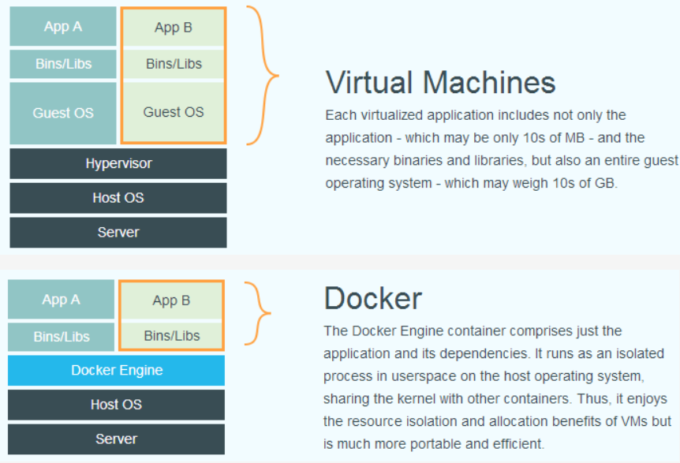
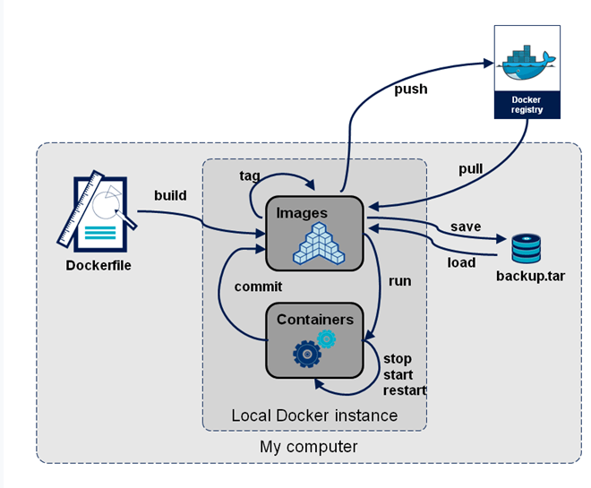
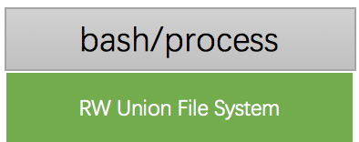

# 概述
Docker是一个开源项目，诞生于2013年初，最初是dotCloud公司内部的一个业余项目。它基于Google公司推出的Go语言实现。项目后来加入了Linux基金会，遵从了Apache2.0协议，项目代码在GitHub上进行维护。

Docker项目的目标是实现轻量级的操作系统虚拟化解决方案。Docker的基础是Linux容器(LXC)等技术。在LXC的基础上Docker进行了进一步封装，让用户不用去关心容器的管理，使得操作更为简便，用户操作docker容器就像操作一个轻量级虚拟机一样简单。

下面的图片比较了 Docker 和传统虚拟化方式的不同之处，可见docker是在操作系统上实现虚拟化，直接复用本地主机的操作系统，而传统方式则是在硬件层面实现。


# 为什么使用docker
作为一种新兴的虚拟化方式，docker跟传统的虚拟化方式相比具备众多的优势。

* 更快速的交付和部署
Docker在整个开发周期都可以完美的辅助你实现快速交付。Docker允许开发者在装有应用和服务的本地容器中做开发，可以直接集成到可持续开发流程中。
例如：开发者可以使用一个标准的镜像来构建一套开发容器，开发完成之后，运维人员可以直接使用这个容器来部署代码。 Docker 可以快速创建容器，快速迭代应用程序，并让整个过程全程可见，使团队中的其他成员更容易理解应用程序是如何创建和工作的。 Docker 容器很轻很快！容器的启动时间是秒级的，大量地节约开发、测试、部署的时间。

* 高效的部署和扩容
Docker 容器几乎可以在任意的平台上运行，包括物理机、虚拟机、公有云、私有云、个人电脑、服务器等。 这种兼容性可以让用户把一个应用程序从一个平台直接迁移到另外一个。
Docker的兼容性和轻量特性可以很轻松的实现负载的动态管理。你可以快速扩容或方便的下线的你的应用和服务，这种速度趋近实时。

* 更高的资源利用率
Docker 对系统资源的利用率很高，一台主机上可以同时运行数千个 Docker 容器。容器除了运行其中应用外，基本不消耗额外的系统资源，使得应用的性能很高，同时系统的开销尽量小。传统虚拟机方式运行 10 个不同的应用就要起 10 个虚拟机，而Docker 只需要启动 10 个隔离的应用即可。

* 更简单的管理
使用 Docker，只需要小小的修改，就可以替代以往大量的更新工作。所有的修改都以增量的方式被分发和更新，从而实现自动化并且高效的管理。

举个最简单的例子：
传统的javaWeb应用是部署在tomcat中的，一个服务器可能运行多个tomcat，每个tomcat中有一个或多个web应用，那么此时docker就可以起到应用隔离和资源独立的作用。


- 如果不使用docker，一台服务器上多个tomcat，即A1，所有的应用共享服务器的CPU、内存等资源，这时如果一个应用出现问题，导致CPU爆满等等，其他应用也会无法运行。
- 那么这时就需要做到资源独立，一个应用一份资源，即我们所说的传统的虚拟化方式，即A2，这样需要在服务器上安装数个虚拟机，每个虚拟机运行一个应用，这样的缺点是，重启虚拟机太麻烦，迁移应用需要重装虚拟机，配置环境等等。
- A3即使用docker，此时服务器上运行多个容器，每个容器都拥有独立的CPU、内存等资源，完全满足了应用隔离的需求，重启容器只需要几秒，迁移应用也很方便，所有装了Docker的服务器，只需把镜像pull或者load进去，run，就可以了。


上图是docker的运行流程

# docker引擎
docker引擎是一个c/s结构的应用，主要组件见下图：


+ server是一个常驻进程
+ REST API实现了server和client之间的交互协议
+ CLI实现容器和镜像的管理，为用户提供统一的管理界面

# docker架构
Docker使用C/S架构，Client 通过接口与Server进程通信实现容器的构建，运行和发布。client和server可以运行在同一台集群，也可以通过跨主机实现远程通信。


# 核心概念
+ 镜像(Image)

docker镜像就是一个只读的模板，如：一个镜像可以包含一个完整的操作系统环境，里面仅安装了Apache或用户需要的其他应用程序。
镜像可以用来创建docker容器，一个镜像可以创建很多容器。Docker 提供了一个很简单的机制来创建镜像或者更新现有的镜像，用户甚至可以直接从其他人那里下载一个已经做好的镜像来直接使用。

镜像（Image）就是一堆只读层（read-only layer）的统一视角，也许这个定义有些难以理解，看看下面这张图：

右边我们看到了多个只读层，它们重叠在一起。除了最上面一层，其它层都会有一个指针指向下一层。这些层是Docker内部的实现细节，并且能够在docker宿主机的文件系统上访问到。统一文件系统（Union File System）技术能够将不同的层整合成一个文件系统，为这些层提供了一个统一的视角，这样就隐藏了多层的存在，在用户的角度看来，只存在一个文件系统。

+ 仓库(repository)
仓库是集中存放镜像文件的场所。有时候会把仓库和仓库注册服务器混为一谈，并不严格区分。实际上，仓库注册服务器往往存放着多个仓库，每个仓库又包含了多个镜像，每个镜像有不同的标签(tag)。

仓库分为公开仓库（Public）和私有仓库（Private）两种形式。最大的公开仓库是 Docker Hub，存放了数量庞大的镜像供用户下载。国内的公开仓库包括 时速云 、网易云 等，可以提供大陆用户更稳定快速的访问。当然，用户也可以在本地网络内创建一个私有仓库。
当用户创建了自己的镜像之后就可以使用 push 命令将它上传到公有或者私有仓库，这样下次在另外一台机器上使用这个镜像时候，只需要从仓库上 pull 下来就可以了。
Docker 仓库的概念跟 Git 类似，注册服务器可以理解为 GitHub 这样的托管服务。

+ 容器(container)
docker利用容器来运行应用。容器时从镜像创建的运行实例。它可以被启动、开始、停止、删除。每个容器都是相互隔离的、保证安全的平台。可以把容器看做是一个简易版的 Linux 环境（包括root用户权限、进程空间、用户空间和网络空间等）和运行在其中的应用程序。
容器的定义和镜像几乎一模一样，也是一堆层的统一视角，唯一区别在于容器的最上面那一层是可读可写的。

一个运行态容器被定义为一个可读写的统一文件系统加上隔离的进程空间和包含其中的进程。下面这张图片展示了一个运行中的容器。

正是文件系统隔离技术使得Docker成为了一个非常有潜力的虚拟化技术。一个容器中的进程可能会对文件进行修改、删除、创建，这些改变都将作用于可读写层。

# docker安装部署
- centos
```
#卸载老版本Docker
 sudo yum remove docker \
                  docker-client \
                  docker-client-latest \
                  docker-common \
                  docker-latest \
                  docker-latest-logrotate \
                  docker-logrotate \
                  docker-selinux \
                  docker-engine-selinux \
                  docker-engine;

#yum-utils提供了yum-config-manager的作用，而device-mapper-persistent-data和lvm2存储驱动程序
sudo yum install -y yum-utils device-mapper-persistent-data lvm2;

#配置docker源
sudo yum-config-manager --add-repo https://download.docker.com/linux/centos/docker-ce.repo

我们必然使用阿里云的镜像：
sudo yum-config-manager --add-repo http://mirrors.aliyun.com/docker-ce/linux/centos/docker-ce.repo

#列出当前可用的的docker-ce版本
yum list docker-ce --showduplicates | sort -r;

#安装docker-ce,可以安装指定版本：sudo yum install docker-ce-18.03.0.ce
sudo yum install docker-ce

#开机自启用
sudo systemctl enable docker

#运行
sudo systemctl start docker
```

# docker常用命令
## 获取镜像
`docker pull`
从仓库获取所需镜像，示例如下:
`docker pull centos:centos6`

实际上相当于 docker pull registry.hub.docker.com/centos:centos6
命令，即从注册服务器 registry.hub.docker.com 中的 centos 仓库来下载标记为 centos6 的镜像。
有时候官方仓库注册服务器下载较慢，可以从其他仓库下载。 从其它仓库下载时需要指定完整的仓库注册服务器地址。

## 查看镜像列表
`docker images`
列出了所有顶层（top-level）镜像。实际上，在这里我们没有办法区分一个镜像和一个只读层，所以我们
提出了top-level镜像。只有创建容器时使用的镜像或者是直接pull下来的镜像能被称为顶层（top-level）
镜像，并且每一个顶层镜像下面都隐藏了多个镜像层。

如：
```
$ docker images
REPOSITORY               TAG                 IMAGE ID            CREATED             SIZE
centos                   centos6             6a77ab6655b9        8 weeks ago         194.6 MB
ubuntu                   latest              2fa927b5cdd3        9 weeks ago         122 MB
```

在列出信息中，可以看到几个字段信息

- 来自于哪个仓库，比如 ubuntu
- 镜像的标记，比如 latest
- 它的 ID 号（唯一）
- 创建时间
- 镜像大小

## 利用dockerfile来创建镜像
`docker build`
使用 docker commit 来扩展一个镜像比较简单，但是不方便在一个团队中分享。我们可以使用docker build 来创建一个新的镜像。为此，首先需要创建一个Dockerfile，包含一些如何创建镜像的指令。新建一个目录和一个Dockerfile。
```
mkdir test_docker
cd test_docker
touch Dockerfile
```

Dockerfile 中每一条指令都创建镜像的一层，例如：
```
FROM centos:centos6
MAINTAINER sandywei <sandy@test.tech>
# move all configuration files into container

RUN yum install -y httpd
EXPOSE 80
CMD ["sh","-c","service httpd start;bash"]
```

### dockerfile基本语法：
Dockfile是一个用于编写docker镜像生成过程的文件，其有特定的语法。在一个文件夹中，如果有一个名字为Dockfile的文件，其内容满足语法要求，在这个文件夹路径下执行命令:docker build --tag name:tag .，就可以按照描述构建一个镜像了。name是镜像的名称，tag是镜像的版本或者是标签号，不写就是lastest。注意后面有一个空格和点。
Dockerfile的基本指令有十三个，分别是：FROM、MAINTAINER、RUN、CMD、EXPOSE、ENV、ADD、COPY、ENTRYPOINT、VOLUME、USER、WORKDIR、ONBUILD。下面对这些指令的用法一一说明。
#### FROM
用法：FROM <image>
说明：第一个指令必须是FROM了，其指定一个构建镜像的基础源镜像，如果本地没有就会从公共库中拉取，没有指定镜像的标签会使用默认的latest标签，可以出现多次，如果需要在一个Dockerfile中构建多个镜像。

#### MAINTAINER
用法：MAINTAINER <name> <email>
说明：描述镜像的创建者，名称和邮箱

#### RUN
用法：RUN "command" "param1" "param2"
说明：RUN命令是一个常用的命令，执行完成之后会成为一个新的镜像，这里也是指镜像的分层构建。一句RUN就是一层，也相当于一个版本。这就是之前说的缓存的原理。我们知道docker是镜像层是只读的，所以你如果第一句安装了软件，用完在后面一句删除是不可能的。所以这种情况要在一句RUN命令中完成，可以通过&符号连接多个RUN语句。RUN后面的必须是双引号不能是单引号（没引号貌似也不要紧），command是不会调用shell的，所以也不会继承相应变量，要查看输入RUN "sh" "-c" "echo" "$HOME"，而不是RUN "echo" "$HOME"。

#### CMD
用法：CMD command param1 param2
说明：CMD在Dockerfile中只能出现一次，有多个，只有最后一个会有效。其作用是在启动容器的时候提供一个默认的命令项。如果用户执行docker run的时候提供了命令项，就会覆盖掉这个命令。没提供就会使用构建时的命令。

#### EXPOSE
用法：EXPOSE <port> [<port>...]
说明：告诉Docker服务器容器对外映射的容器端口号，在docker run -p的时候生效。

#### EVN
用法：EVN <key> <value> 只能设置一个

	  EVN <key>=<value>允许一次设置多个
说明：设置容器的环境变量，可以让其后面的RUN命令使用，容器运行的时候这个变量也会保留。

#### ADD
用法：ADD <src>   <dest>
说明：复制本机文件或目录或远程文件，添加到指定的容器目录，支持GO的正则模糊匹配。路径是绝对路径，不存在会自动创建。如果源是一个目录，只会复制目录下的内容，目录本身不会复制。ADD命令会将复制的压缩文件夹自动解压，这也是与COPY命令最大的不同。

#### COPY
用法：COPY <src> <dest>
说明：COPY除了不能自动解压，也不能复制网络文件。其它功能和ADD相同。

#### ENTRYPOINT
用法：ENTRYPOINT "command" "param1" "param2"
说明：这个命令和CMD命令一样，唯一的区别是不能被docker run命令的执行命令覆盖，如果要覆盖需要带上选项--entrypoint，如果有多个选项，只有最后一个会生效。

#### VOLUME
用法：VOLUME ["path"]
说明：在主机上创建一个挂载，挂载到容器的指定路径。docker run -v命令也能完成这个操作，而且更强大。这个命令不能指定主机的需要挂载到容器的文件夹路径。但docker run -v可以，而且其还可以挂载数据容器。

#### USER
用法：USER daemon
说明：指定运行容器时的用户名或UID，后续的RUN、CMD、ENTRYPOINT也会使用指定的用户运行命令。

#### WORKDIR
用法:WORKDIR path
说明：为RUN、CMD、ENTRYPOINT指令配置工作目录。可以使用多个WORKDIR指令，后续参数如果是相对路径，则会基于之前的命令指定的路径。如：WORKDIR  /home　　WORKDIR test 。最终的路径就是/home/test。path路径也可以是环境变量，比如有环境变量HOME=/home，WORKDIR $HOME/test也就是/home/test。

#### ONBUILD
用法：ONBUILD [INSTRUCTION]
说明：配置当前所创建的镜像作为其它新创建镜像的基础镜像时，所执行的操作指令。意思就是，这个镜像创建后，如果其它镜像以这个镜像为基础，会先执行这个镜像的ONBUILD命令。

###	Dockerfile例子
一个使用安装包安装的tomcat例子：
```
FROM centos
MAINTAINER nobody "xx@qq.com"
RUN mkdir -p /opt/jdk/
RUN mkdir -p /opt/tomcat/
ADD jdk1.7.0_79 /opt/jdk/
ADD tomcat  /opt/tomcat/
ENV CATALINA_HOME /opt/tomcat
ENV JAVA_HOME /opt/jdk
EXPOSE 8080
ENV PATH $PATH:$JAVA_HOME/bin
CMD ["/opt/tomcat/bin/catalina.sh","run"]
```

更详细的语法说明请参考 https://docs.docker.com/engine/reference/builder/

编写完成 Dockerfile 后可以使用 docker build 来生成镜像。
```
$ docker build -t test/httpd:1.0 .

Sending build context to Docker daemon 2.048 kB
Step 1 : FROM centos:centos6
 ---> 6a77ab6655b9
Step 2 : MAINTAINER sandywei <sandy@test.tech>
 ---> Running in 1b26493518a7
 ---> 8877ee5f7432
Removing intermediate container 1b26493518a7
Step 3 : RUN yum install -y httpd
 ---> Running in fe5b6f1ef888

 .....

 Step 5 : CMD sh -c service httpd start
 ---> Running in b2b94c1601c2
 ---> 5f9aa91b0c9e
Removing intermediate container b2b94c1601c2
Successfully built 5f9aa91b0c9e
```
其中 -t 标记来添加 tag，指定新的镜像的用户信息。 “.” 是 Dockerfile 所在的路径（当前目录），
也可以替换为一个具体的 Dockerfile 的路径。注意一个镜像不能超过 127 层。

用docker images 查看镜像列表
```
$ docker images
REPOSITORY                 TAG               IMAGE ID            CREATED             SIZE
test/httpd               1.0               5f9aa91b0c9e        3 minutes ago       292.4 MB
centos                   centos6             6a77ab6655b9        8 weeks ago         194.6 MB
ubuntu                   latest              2fa927b5cdd3        9 weeks ago         122 MB
```
可以发现最后一层的ID（5f9aa91b0c9e）和 image id是一样的

## 上传镜像
`docker push`
用户可以通过 docker push 命令，把自己创建的镜像上传到仓库中来共享。例如，用户在 Docker Hub 上完成注册后，可以推送自己的镜像到仓库中。

运行实例：
`$ docker push test/httpd:1.0`

## 创建容器
`docker create <image-id>`
docker create 命令为指定的镜像（image）添加了一个可读写层，构成了一个新的容器。注意，这个容器并没有运行。

docker create 命令提供了许多参数选项可以指定名字，硬件资源，网络配置等等。

如：
创建一个centos的容器，可以使用仓库＋标签的名字确定image，也可以使用image－id指定image。返回容器id
```
＃查看本地images列表
$ docker images

＃用仓库＋标签
$ docker create -it --name centos6_container centos:centos6

＃使用image－id
$ docker create -it --name centos6_container 6a77ab6655b9 bash
b3cd0b47fe3db0115037c5e9cf776914bd46944d1ac63c0b753a9df6944c7a67

#可以使用 docker ps查看一件存在的容器列表,不加参数默认只显示当前运行的容器
$ docker ps -a
```

可以使用 -v 参数将本地目录挂载到容器中。
`$ docker create -it --name centos6_container -v /src/webapp:/opt/webapp centos:centos6`
这个功能在进行测试的时候十分方便，比如用户可以放置一些程序到本地目录中，来查看容器是否正常工作。本地目录的路径必须是绝对路径，如果目录不存在 Docker 会自动为你创建它。

## 启动容器
`docker start <container-id>`
Docker start命令为容器文件系统创建了一个进程隔离空间。注意，每一个容器只能够有一个进程隔离空间。

如：
```
#通过名字启动
$ docker start -i centos6_container

＃通过容器ID启动
$ docker start -i b3cd0b47fe3d
```

## 进入容器
`docker exec <container-id>`

在当前容器中执行新命令，如果增加 -it参数运行bash 就和登录到容器效果一样的。
`docker exec -it centos6_container bash`

## 停止容器
`docker stop <container-id>`

## 删除容器
`docker rm <container-id>`

## 运行容器
`docker run <image-id>`

docker run就是docker create和docker start两个命令的组合,支持参数也是一致的，如果指定容器
名字是，容器已经存在会报错,可以增加 --rm 参数实现容器退出时自动删除。

如：
`docker create -it --rm --name centos6_container centos:centos6`

## 查看容器列表
`docker ps`
docker ps 命令会列出所有运行中的容器。这隐藏了非运行态容器的存在，如果想要找出这些容器，增加-a参数。

## 删除镜像
`docker rmi <image-id>`

删除构成镜像的一个只读层。你只能够使用docker rmi来移除最顶层（top level layer）
（也可以说是镜像），你也可以使用-f参数来强制删除中间的只读层。

## commit容器
`docker commit <container-id>`
将容器的可读写层转换为一个只读层，这样就把一个容器转换成了不可变的镜像。

## 镜像保存
`docker save <image-id>`

创建一个镜像的压缩文件，这个文件能够在另外一个主机的Docker上使用。和export命令不同，这个命令
为每一个层都保存了它们的元数据。这个命令只能对镜像生效。

如：
```
#保存centos镜像到centos_images.tar 文件
$ docker save  -o centos_images.tar centos:centos6

＃或者直接重定向
$ docker save  -o centos_images.tar centos:centos6 > centos_images.tar
```

## 容器导出
`docker export <container-id>`

创建一个tar文件，并且移除了元数据和不必要的层，将多个层整合成了一个层，只保存了当前统一视角看到
的内容。expoxt后的容器再import到Docker中，只有一个容器当前状态的镜像；而save后的镜像则不同，
它能够看到这个镜像的历史镜像。

## inspect
`docker inspect <container-id> or <image-id>`
docker inspect命令会提取出容器或者镜像最顶层的元数据

# docker安装指定版本TAG的镜像
在docker中安装镜像，一般过程是，docker search 软件名称。
本文以tomcat为例，讲解下载指定版本TAG的tomcat。

搜索tomcat镜像：
`sudo docker search tomcat`

发现只有tomcat，而如果docker pull tomcat，下载下来的是最新版的tomcat,也就是tomcat11。假设希望下载的是tomcat:8-jre8。那么该如何做呢？
如果search出来的镜像，不是自己想要的版本，可通过在docker hub上搜索好版本TAG，地址如下：https://hub.docker.com，进入之后，在页面左上角搜索框搜索`tomcat`，
搜索出来之后，点详情，点击标签，在下面通过翻页，找到8-jre标签，复制标签名：8-jre8，下载tomcat镜像
`sudo docker pull tomcat:8-jre8`

