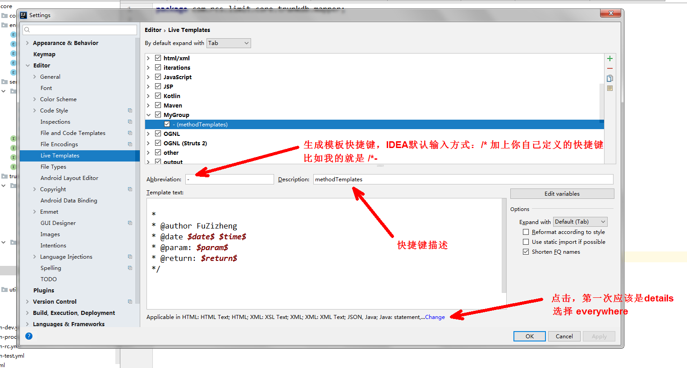

记录自己idea的个性化设置。
记得定期将自己的setting导出，新环境直接导入就好了。
file->export setting

# 插件安装
## 热部署jRebel
https://blog.csdn.net/xingbaozhen1210/article/details/81093041

## Mybatis Plugin
1.提供Mapper接口与配置文件中对应SQL的导航
2.编辑XML文件时自动补全..等

File->settings->左上角搜索plugin->选择marketplace->输入Mybatis Plugin，回车搜索。
筛选结果有free mybatis plugin，和mybatis plugin。这里安装free的就好，免费版的已经可以满足日常使用需求。

## 彩色进度条
Plugins->Marketplace，搜索`Nyan Progress Bar`，一个彩色的进度条。

## 安装mybatis-generator(自动生成三件套)
官网：http://www.mybatis.org/generator/
github：https://github.com/mybatis/generator/releases
在pom.xml中添加如下插件：
```
<plugin>
    <groupId>org.mybatis.generator</groupId>
    <artifactId>mybatis-generator-maven-plugin</artifactId>
    <version>1.3.2</version>
    <dependencies>
        <dependency>
            <groupId>mysql</groupId>
            <artifactId>mysql-connector-java</artifactId>
            <version>5.1.38</version>
        </dependency>
    </dependencies>
    <configuration>
        <!--配置文件的路径-->
        <configurationFile>src/main/resources/MBG/generatorConfig.xml</configurationFile>
        <overwrite>true</overwrite>
    </configuration>
</plugin>
```

加入配置文件：
```
<?xml version="1.0" encoding="UTF-8"?>
<!DOCTYPE generatorConfiguration
        PUBLIC "-//mybatis.org//DTD MyBatis Generator Configuration 1.0//EN"
        "http://mybatis.org/dtd/mybatis-generator-config_1_0.dtd">

<generatorConfiguration>
    <!--修改驱动包的路径-->
    <classPathEntry location="/home/wjy/.m2/repository/mysql/mysql-connector-java/5.1.38/mysql-connector-java-5.1.38.jar" />
    <context id="testTables" targetRuntime="MyBatis3">
        <property name="javaFileEncoding" value="UTF-8"/>
        <!-- 生成toString -->
        <plugin type="org.mybatis.generator.plugins.ToStringPlugin" />

        <!-- JavaBean 实现 序列化 接口 -->
        <plugin type="org.mybatis.generator.plugins.SerializablePlugin">
        </plugin>
        <!--generate entity时，生成hashcode和equals方法-->
        <plugin type="org.mybatis.generator.plugins.EqualsHashCodePlugin" />


        <commentGenerator>
            <!-- 是否去除自动生成的注释 true：是 ： false:否 -->
            <property name="suppressAllComments" value="true" />
        </commentGenerator>
        <!--数据库连接的信息：驱动类、连接地址、用户名、密码 -->
        <jdbcConnection driverClass="com.mysql.jdbc.Driver"
                        connectionURL="jdbc:mysql://localhost:3306/test?useUnicode=true&amp;characterEncoding=utf8&amp;allowMultiQueries=true&amp;autoReconnect=true"
                        userId="root" password="root">
        </jdbcConnection>
        <!-- <jdbcConnection driverClass="oracle.jdbc.OracleDriver"
            connectionURL="jdbc:oracle:thin:@127.0.0.1:1521:yycg"
            userId="yycg"
            password="yycg">
        </jdbcConnection> -->

        <!-- 默认false，把JDBC DECIMAL 和 NUMERIC 类型解析为 Integer，为 true时把JDBC DECIMAL 和
            NUMERIC 类型解析为java.math.BigDecimal -->
        <javaTypeResolver>
            <property name="forceBigDecimals" value="false" />
        </javaTypeResolver>

        <!-- 生成模型model的包名和位置 -->
        <javaModelGenerator targetPackage="com.wjy.model" targetProject="src" >
            <!--<property name="enableSubPackages" value="true" />-->
            <!--<property name="trimStrings" value="true" />-->
        </javaModelGenerator>
        <!-- 生成的映射文件mapper.xml包名和位置 -->
        <sqlMapGenerator targetPackage="mapper" targetProject="src">
            <!--<property name="enableSubPackages" value="true" />-->
        </sqlMapGenerator>
        <!-- 生成XXXMapper.java接口文件的包名和位置 -->
        <javaClientGenerator type="XMLMAPPER" targetPackage="com.wjy.mapper" targetProject="src">
            <!--<property name="enableSubPackages" value="true" />-->
        </javaClientGenerator>

        <!-- 指定数据库表 -->
        <table schema="test" tableName="test" enableCountByExample="false"
               enableUpdateByExample="false" enableDeleteByExample="false" enableSelectByExample="false" selectByExampleQueryId="fasle" />

        <!--去掉Mybatis Generator生成的一堆 example
        <table schema="general" tableName="tb_table_name" domainObjectName="EntityName"
               enableCountByExample="false" enableUpdateByExample="false" enableDeleteByExample="false"
               enableSelectByExample="false" selectByExampleQueryId="false" >
            <property name="useActualColumnNames" value="true"/>
        </table>
        -->

        <!-- 有些表的字段需要指定java类型
         <table schema="" tableName="">
            <columnOverride column="" javaType="" />
        </table> -->
    </context>

</generatorConfiguration>
```
需要修改配置文件头部`mysql-connector-java`的路径，改为本地驱动包路径。(在本地maven仓库中找)
需要注意connector的版本号。

所有配置含义：
https://www.jianshu.com/p/e09d2370b796

# 注释模板
- 类注释模板
`File ---> Setting ---> Editor ---> File and Code Templates ---> Includes --->File Header`
```
/**
 *@author: wjy
 *@Date: Create in ${TIME} ${DATE}
 *@description :
 */
```
idea设置页的下边，有变量的解释

- 方法注释模板
`File ---> Setting ---> Editor ---> LiveTemplates`
点击右边上面那个绿色的+号，选择Template Group双击，然后弹出一个窗口，起名，然后点击ok
然后在列表中，选择刚才新建的Template Group，再次点击右上角的绿色加号，选择第一个选项 live Template

注释模板中$...$中间的参数要与你刚才设置的参数名一一对应
按下 /* 加上你定义的快捷键，再按tab就能生成方法模板了~
ps:为了只按/+自定义的快捷键，我们可以在模板的顶端，注意要顶格，
加上两个`**`
完成后点击应用ok~

提供两种模板：
```
**
 * @author: wjy 
 * @description: 
 * @date: $date$ $time$
 * @param: $params$
 * @return: $returns$
 */ 
```
```
**
 * @author: wjy 
 * @description:
 */ 
```

# 窗口开多后自动关闭
idea 默认的窗口数量只有10个，开多了会自动把前边的关掉，可以将多开数量设置wier30。
File->Settings->Editor->General->Editor Tabs，找到Tab limit，将值设置为30。

# idea输入法不跟随
jetbrains官方已经在2018.2版本修复了这个问题。但是还是需要新版jdk的加持。
目前可以确定，idea--2018.3版本+jdk1.8.0_191没有问题。
win10自带的输入法也是没有问题的。
如果jdk是升级上来的，就是本机安装的事1.8.0_191以下的版本，然后通过官方升级上来的，貌似就不行。建议去官网重新下载新版jdk。
这个问题不同环境需要不同的解决方法，多试几种就是了。

先摘抄几种网上的方法

方法1：
idea界面按ctrl+shift+a，输入switch IDE Boot JDK，选择自己安装的jdk，默认是idea自带的jre，貌似是有bug。选择完之后重启

方法2：
增加一个环境变量即可。 64位增加的名称为IDEA_JDK_64，32位的为IDEA_JDK，值为本机jdk根目录。

比较靠谱的就这两种，还有很多说jdk降级，输入法降级的，不建议。

# 去掉重复代码检查
File->Settings->Editor->Inspections->
右侧列表寻找`General`，去掉`Duplicated code fragment`的勾选。

# 去掉Mybatis-xml文件的浅黄背景色
1. File->Settings->Editor->Inspections->
右侧列表寻找`SQL`，去掉`No data sources configured`和`SQL dialect detection`勾选项。

2. File->Settings->Editor->Color Scheme->General
在右侧列表寻找code下拉选，找到`Injected language fragment`，去掉右侧Background勾选。

# 从Coding拉取代码
File->New->Project from Version Control->Git
在URL一行填写Coding上项目的地址，如：
https://git.coding.net/test.git


# 将项目上传到Coding
- https://coding.net/user
通过上面地址登陆自己的Coding，鼠标移到右上角的加号，点击项目
https://coding.net/user/projects/create(或访问该地址，进入到新建项目界面)
- 输入必填的项目名称和项目地址，拉到最下面添加项目成员，其他全部默认，点击新建项目，然后进入到项目管理界面。
- 找到右侧的项目地址，复制。

## 将Idea中的项目上传
- 回到Idea，点击工具栏的VCS，选择`Import into Version Control`，选择`Create Git Repository`，选择想要上传到Coding的项目。
- 选择到项目根目录(项目名位置)，右键选择Git，选择+ Add。
- 再次右键项目，选择Git->Repository->remotes，点击加号，name为origin，URL为刚才复制的Coding项目地址。
- 然后进行第一次提交。点击工具栏的VCS->Commit(Ctrl+T)，输入Commit Message，点击右下角Commit位置的下拉选，选择Commit and push(Ctrl+Alt+K)，然后点击Push。
然后就其他人就可以拉取代码了。

提交时报错：
```
Can't update: no tracked branch
No tracked branch configured for branch master.
To make your branch track a remote branch call, for example,
git branch --set-upstream master origin/master
```
尝试建议的指令：
`git branch --set-upstream master origin/master`
无果。

解决：
到项目的根目录，以此执行：
`git add .`
`git commit -m 'first commit'`
`git push -u origin master`
push成功，然后就可以通过idea`ctrl+K`上传，`ctrl+T`拉取代码了。

## 通过命令行上传
- 在本地项目的根目录打开git bush或Terminal，输入`git init`，初始化仓库。
- 然后执行`git add .`、`git commit -m 'first commit'`，将项目添加并提交的本地缓存区。
- 执行`git remote add origin https://git.coding.net/jingyao/123.git`，将本地仓库和远程仓库关联。
- 然后可以把本地仓库的内容推送到远程仓库上`git push -u origin master`，推送需要输入Coding的用户名和密码。
- 如果想不是每次推送都输入账号密码，可以添加SSH公钥，参考：https://coding.net/help/doc/git/ssh-key.html

# 中文乱码

