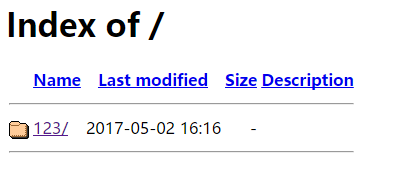

# 软件安装
## mysql


## tomcat
官网下载：
https://tomcat.apache.org/download-90.cgi
找到Core下的tar.gz包下载并上传到/usr/local 目录下。

到usr/local目录下解压：
`tar -zxvf apache-tomcat-9.0.1.tar.gz`

tomcat默认端口是8080，这里为了防止和其他任务端口冲突，我们将端口修改为合适的端口。
cd到/tomcat/conf，`vi server.xml`，找到`Connector port="8080"`的位置，修改为恰当的端口。

cd到tomcat的bin目录下：
`cd ../bin`，启动tomcat`./startup.sh`，看到日志末尾`Tomcat started`，说明tomcat启动成功。

查看tomcat日志：
`tail -f logs/catalina.out`

若远程无法访问，可能需要在阿里云控制台添加端口白名单。或者是防火墙

## git
先确认是否安装了git：
`rpm -qa|grep git`
如果安装了需要先卸载：
`rpm -e --nodeps git  或者  rpm -e git`

安装：
`yum install git`
再使用 rpm -qa|grep git 来查看是否已经安装好了Git。

## maven
1. 到指定目录下载maven：
`wget http://mirrors.tuna.tsinghua.edu.cn/apache/maven/maven-3/3.3.9/binaries/apache-maven-3.3.9-bin.tar.gz`

2. 解压：
`tar -zxvf apache-maven-3.3.9-bin.tar.gz `

3. 改下名，方便后面操作：
`mv apache-maven-3.3.9 maven`

4. 配置环境变量
`vi /etc/profile`，在合适的位置添加如下内容：
`M2_HOME=/opt/tyrone/maven （需要修改为自己maven的安装路径）`
`export PATH=${M2_HOME}/bin:${PATH}`

然后使配置文件生效：
`source /etc/profile`

5. 检查是否安装成功
`mvn -v`
出现版本号：`Apache Maven 3.3.9...`，证明安装成功。

## zookeeper
下载地址：
http://mirror.bit.edu.cn/apache/zookeeper/
下载stable版本。

将下载好的.gz解压并复制到想要的位置。/home/wjy/install

在zk的根目录创建两个文件夹data和data_log，分别用来存放zk的数据以及日志。然后进入到data目录，使用pwd指令查看并复制data目录的绝对路径。

进入zookeeper的conf目录下，复制zoo_sample.cfg为zoo.cfg
`cp zoo_sample.cfg zoo.cfg`

然后编辑zoo.cfg，修改或新增下面两行配置：
```
dataDir=/home/wjy/install/zookeeper-3.4.13/data
dataLogDir=/home/wjy/install/zookeeper-3.4.13/data_log
```
保存并退出。

zoo.cfg只存放了单机的配置，想配置集群需要在最后面加上其他服务器的ip和端口。

到zk的bin目录下启动：
`./zkServer.sh start`

查看状态
`./zkServer.sh status`
```
ZooKeeper JMX enabled by default
Using config: /home/wjy/install/zookeeper-3.4.13/bin/../conf/zoo.cfg
Mode: standalone
```
出现上边的状态说明启动成功。
standalone：单机

## redis
https://redis.io/
官网下载，解压并复制到想要的位置 /home/wjy/install

cd到redis根目录下，执行
`make`
报错：
```
net.c:36:23: fatal error: sys/types.h: No such file or directory(没有那个文件或目录)
...
adlist.c:32:20: fatal error: stdlib.h: No such file or directory
```
原因是缺少文件，执行以下命令后再次make：
`sudo apt-get install libc6-dev`

还是报错:
`zmalloc.h:50:31: fatal error: jemalloc/jemalloc.h: No such file or directory`

原因是libc不是默认的分配器，在make后添加参数解决：
`sudo make MALLOC=libc`

等待执行完成，到redis/src目录下，执行
`./redis-server`
出现端口号和进程PID，证明启动成功。

通过上边的指令启动redis，`ctrl+c`推出窗口，redis也会关闭，可以在指令后加上`&`
`./redis-server &`
按ctrl + C 可退出redis 启动窗口，此时redis　并不会关闭，而是会再后台运行，可通过命令查看: ps aux | grep redis

# 技巧
## apache下载文件

1. 找到apache的安装目录，httpd目录
2. 进入到conf.d目录下
3. 删掉welcome.conf
`rm –rf welcome.conf`
4. 回到apache的安装目录下，进入到conf 文件夹下
5. 查看httpd.conf文件(里面有默认访问页面的路径)
`vi httpd.conf`
找到这个：
`DocumentRoot "/var/www/html"`
这个是你apache默认的访问页面，进入到这个文件夹
这个文件夹下的内容会被显示到apahce的默认访问页里，把你想要下载的东西打包成压缩文件，传到这个文件夹下，就可以通过ip访问下载了。
