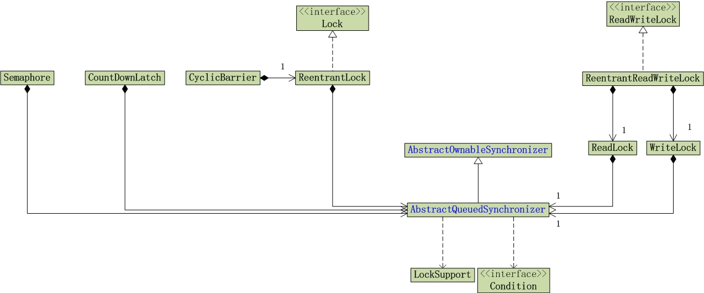
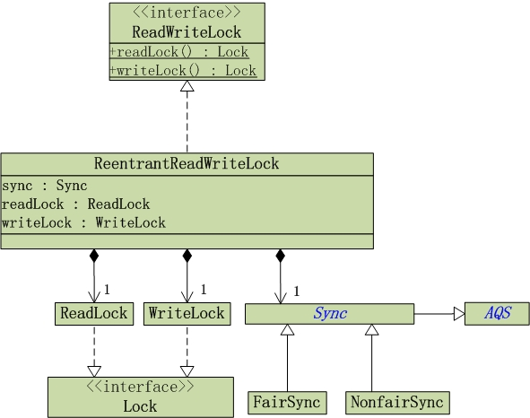
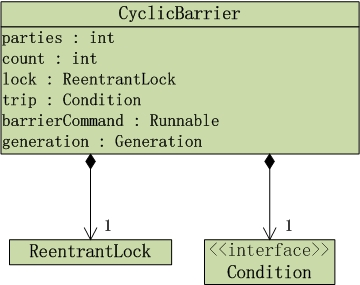
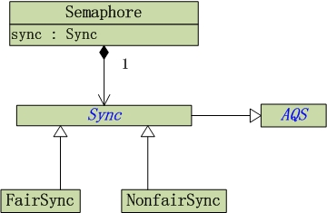

根据锁的添加到Java中的时间，Java中的锁，可以分为"同步锁"和"JUC包中的锁"。

# 同步锁
即通过synchronized关键字来进行同步，实现对竞争资源的互斥访问的锁。Java 1.0版本中就已经支持同步锁了。
同步锁的原理是，对于每一个对象，有且仅有一个同步锁；不同的线程能共同访问该同步锁。但是，在同一个时间点，该同步锁能且只能被一个线程获取到。这样，获取到同步锁的线程就能进行CPU调度，从而在CPU上执行；而没有获取到同步锁的线程，必须进行等待，直到获取到同步锁之后才能继续运行。这就是多线程通过同步锁进行同步的原理。

# JUC包中的锁
相比同步锁，JUC包中的锁的功能更加强大，它为锁提供了一个框架，该框架允许更灵活地使用锁，只是它的用法更难罢了。
JUC包中的锁，包括：Lock接口，ReadWriteLock接口，LockSupport阻塞原语，Condition条件，AbstractOwnableSynchronizer/AbstractQueuedSynchronizer/AbstractQueuedLongSynchronizer三个抽象类，ReentrantLock独占锁，ReentrantReadWriteLock读写锁。由于CountDownLatch，CyclicBarrier和Semaphore也是通过AQS来实现的；因此，我也将它们归纳到锁的框架中进行介绍。
先看看锁的框架图，如下所示。


1. Lock接口
JUC包中的 Lock 接口支持那些语义不同(重入、公平等)的锁规则。所谓语义不同，是指锁可是有"公平机制的锁"、"非公平机制的锁"、"可重入的锁"等等。"公平机制"是指"不同线程获取锁的机制是公平的"，而"非公平机制"则是指"不同线程获取锁的机制是非公平的"，"可重入的锁"是指同一个锁能够被一个线程多次获取。

2. ReadWriteLock
ReadWriteLock 接口以和Lock类似的方式定义了一些读取者可以共享而写入者独占的锁。JUC包只有一个类实现了该接口，即 ReentrantReadWriteLock，因为它适用于大部分的标准用法上下文。但程序员可以创建自己的、适用于非标准要求的实现。

3. AbstractOwnableSynchronizer/AbstractQueuedSynchronizer/AbstractQueuedLongSynchronizer
AbstractQueuedSynchronizer就是被称之为AQS的类，它是一个非常有用的超类，可用来定义锁以及依赖于排队阻塞线程的其他同步器；ReentrantLock，ReentrantReadWriteLock，CountDownLatch，CyclicBarrier和Semaphore等这些类都是基于AQS类实现的。AbstractQueuedLongSynchronizer 类提供相同的功能但扩展了对同步状态的 64 位的支持。两者都扩展了类 AbstractOwnableSynchronizer（一个帮助记录当前保持独占同步的线程的简单类）。

4. LockSupport
LockSupport提供“创建锁”和“其他同步类的基本线程阻塞原语”。 
LockSupport的功能和"Thread中的Thread.suspend()和Thread.resume()有点类似"，LockSupport中的park() 和 unpark() 的作用分别是阻塞线程和解除阻塞线程。但是park()和unpark()不会遇到“Thread.suspend 和 Thread.resume所可能引发的死锁”问题。

 

5. Condition
Condition需要和Lock联合使用，它的作用是代替Object监视器方法，可以通过await(),signal()来休眠/唤醒线程。
Condition 接口描述了可能会与锁有关联的条件变量。这些变量在用法上与使用 Object.wait 访问的隐式监视器类似，但提供了更强大的功能。需要特别指出的是，单个 Lock 可能与多个 Condition 对象关联。为了避免兼容性问题，Condition 方法的名称与对应的 Object 版本中的不同。

6. ReentrantLock
ReentrantLock是独占锁。所谓独占锁，是指只能被独自占领，即同一个时间点只能被一个线程锁获取到的锁。ReentrantLock锁包括"公平的ReentrantLock"和"非公平的ReentrantLock"。"公平的ReentrantLock"是指"不同线程获取锁的机制是公平的"，而"非公平的　　ReentrantLock"则是指"不同线程获取锁的机制是非公平的"，ReentrantLock是"可重入的锁"。
ReentrantLock的UML类图如下：


	- ReentrantLock实现了Lock接口。
	- ReentrantLock中有一个成员变量sync，sync是Sync类型；Sync是一个抽象类，而且它继承于AQS。
	- ReentrantLock中有"公平锁类"FairSync和"非公平锁类"NonfairSync，它们都是Sync的子类。ReentrantReadWriteLock中sync对象，是FairSync与NonfairSync中的一种，这也意味着ReentrantLock是"公平锁"或"非公平锁"中的一种，ReentrantLock默认是非公平锁。

7. ReentrantReadWriteLock
ReentrantReadWriteLock是读写锁接口ReadWriteLock的实现类，它包括子类ReadLock和WriteLock。ReentrantLock是共享锁，而WriteLock是独占锁。
ReentrantReadWriteLock的UML类图如下：


	- ReentrantReadWriteLock实现了ReadWriteLock接口。
	- ReentrantReadWriteLock中包含sync对象，读锁readerLock和写锁writerLock。读锁ReadLock和写锁WriteLock都实现了Lock接口。
	- 和"ReentrantLock"一样，sync是Sync类型；而且，Sync也是一个继承于AQS的抽象类。Sync也包括"公平锁"FairSync和"非公平锁"NonfairSync。


8. CountDownLatch
CountDownLatch是一个同步辅助类，在完成一组正在其他线程中执行的操作之前，它允许一个或多个线程一直等待。 
CountDownLatch的UML类图如下：


CountDownLatch包含了sync对象，sync是Sync类型。CountDownLatch的Sync是实例类，它继承于AQS。

9. CyclicBarrier
CyclicBarrier是一个同步辅助类，允许一组线程互相等待，直到到达某个公共屏障点 (common barrier point)。因为该 barrier 在释放等待线程后可以重用，所以称它为循环 的 barrier。
CyclicBarrier的UML类图如下：


CyclicBarrier是包含了"ReentrantLock对象lock"和"Condition对象trip"，它是通过独占锁实现的。
CyclicBarrier和CountDownLatch的区别是：
	- CountDownLatch的作用是允许1或N个线程等待其他线程完成执行；而CyclicBarrier则是允许N个线程相互等待。
	- CountDownLatch的计数器无法被重置；CyclicBarrier的计数器可以被重置后使用，因此它被称为是循环的barrier。

10. Semaphore
Semaphore是一个计数信号量，它的本质是一个"共享锁"。
信号量维护了一个信号量许可集。线程可以通过调用acquire()来获取信号量的许可；当信号量中有可用的许可时，线程能获取该许可；否则线程必须等待，直到有可用的许可为止。 线程可以通过release()来释放它所持有的信号量许可。
Semaphore的UML类图如下：


和"ReentrantLock"一样，Semaphore包含了sync对象，sync是Sync类型；而且，Sync也是一个继承于AQS的抽象类。Sync也包括"公平信号量"FairSync和"非公平信号量"NonfairSync。

## 互斥锁ReentrantLock
ReentrantLock是一个可重入的互斥锁，又被称为独占锁。
顾名思义，ReentrantLock锁在同一个时间点只能被一个线程锁持有，可重入表示ReentrantLock锁可被单个线程多次获取。
ReentrantLock分为公平锁和非公平锁，它们的区别体现在获取锁的机制上是否公平。锁是为了保护竞争资源，防止多个线程同时操作同一对象而出错。
ReentrantLock在同一时间点只能被一个线程获取(当某线程获取到锁时，其他线程必须等待)。ReentrantLock是通过一个FIFO的等待队列来管理获取该锁的所有线程的。
在公平锁的机制下，线程一次排队获取锁，而非公平锁在锁是可获取状态时，不管自己是不是在队列的开头都会获取锁。

### ReentrantLock函数列表
```java
// 创建一个 ReentrantLock ，默认是“非公平锁”。
ReentrantLock()
// 创建策略是fair的 ReentrantLock。fair为true表示是公平锁，fair为false表示是非公平锁。
ReentrantLock(boolean fair)

// 查询当前线程保持此锁的次数。
int getHoldCount()
// 返回目前拥有此锁的线程，如果此锁不被任何线程拥有，则返回 null。
protected Thread getOwner()
// 返回一个 collection，它包含可能正等待获取此锁的线程。
protected Collection<Thread> getQueuedThreads()
// 返回正等待获取此锁的线程估计数。
int getQueueLength()
// 返回一个 collection，它包含可能正在等待与此锁相关给定条件的那些线程。
protected Collection<Thread> getWaitingThreads(Condition condition)
// 返回等待与此锁相关的给定条件的线程估计数。
int getWaitQueueLength(Condition condition)
// 查询给定线程是否正在等待获取此锁。
boolean hasQueuedThread(Thread thread)
// 查询是否有些线程正在等待获取此锁。
boolean hasQueuedThreads()
// 查询是否有些线程正在等待与此锁有关的给定条件。
boolean hasWaiters(Condition condition)
// 如果是“公平锁”返回true，否则返回false。
boolean isFair()
// 查询当前线程是否保持此锁。
boolean isHeldByCurrentThread()
// 查询此锁是否由任意线程保持。
boolean isLocked()
// 获取锁。
void lock()
// 如果当前线程未被中断，则获取锁。
void lockInterruptibly()
// 返回用来与此 Lock 实例一起使用的 Condition 实例。
Condition newCondition()
// 仅在调用时锁未被另一个线程保持的情况下，才获取该锁。
boolean tryLock()
// 如果锁在给定等待时间内没有被另一个线程保持，且当前线程未被中断，则获取该锁。
boolean tryLock(long timeout, TimeUnit unit)
// 试图释放此锁。
void unlock()
```

### ReentrantLock示例
```java
import java.util.concurrent.locks.Lock;
import java.util.concurrent.locks.ReentrantLock;

// LockTest1.java
// 仓库
class Depot { 
    private int size;        // 仓库的实际数量
    private Lock lock;        // 独占锁

    public Depot() {
        this.size = 0;
        this.lock = new ReentrantLock();
    }

    public void produce(int val) {
        lock.lock();
        try {
            size += val;
            System.out.printf("%s produce(%d) --> size=%d\n", 
                    Thread.currentThread().getName(), val, size);
        } finally {
            lock.unlock();
        }
    }

    public void consume(int val) {
        lock.lock();
        try {
            size -= val;
            System.out.printf("%s consume(%d) <-- size=%d\n", 
                    Thread.currentThread().getName(), val, size);
        } finally {
            lock.unlock();
        }
    }
}; 

// 生产者
class Producer {
    private Depot depot;
    
    public Producer(Depot depot) {
        this.depot = depot;
    }

    // 消费产品：新建一个线程向仓库中生产产品。
    public void produce(final int val) {
        new Thread() {
            public void run() {
                depot.produce(val);
            }
        }.start();
    }
}

// 消费者
class Customer {
    private Depot depot;
    
    public Customer(Depot depot) {
        this.depot = depot;
    }

    // 消费产品：新建一个线程从仓库中消费产品。
    public void consume(final int val) {
        new Thread() {
            public void run() {
                depot.consume(val);
            }
        }.start();
    }
}

public class LockTest1 {  
    public static void main(String[] args) {  
        Depot mDepot = new Depot();
        Producer mPro = new Producer(mDepot);
        Customer mCus = new Customer(mDepot);

        mPro.produce(60);
        mPro.produce(120);
        mCus.consume(90);
        mCus.consume(150);
        mPro.produce(110);
    }
}
```
运行结果：
```
Thread-0 produce(60) --> size=60
Thread-1 produce(120) --> size=180
Thread-3 consume(150) <-- size=30
Thread-2 consume(90) <-- size=-60
Thread-4 produce(110) --> size=50
```
结果分析：
- Depot 是个仓库。通过produce()能往仓库中生产货物，通过consume()能消费仓库中的货物。通过独占锁lock实现对仓库的互斥访问：在操作(生产/消费)仓库中货品前，会先通过lock()锁住仓库，操作完之后再通过unlock()解锁。
- Producer是生产者类。调用Producer中的produce()函数可以新建一个线程往仓库中生产产品。
- Customer是消费者类。调用Customer中的consume()函数可以新建一个线程消费仓库中的产品。
- 在主线程main中，我们会新建1个生产者mPro，同时新建1个消费者mCus。它们分别向仓库中生产/消费产品。
根据main中的生产/消费数量，仓库最终剩余的产品应该是50。运行结果是符合我们预期的！

这个模型存在两个问题：
- 现实中，仓库的容量不可能为负数。但是，此模型中的仓库容量可以为负数，这与现实相矛盾！
- 现实中，仓库的容量是有限制的。但是，此模型中的容量确实没有限制的！
这两个问题，我们稍微会讲到如何解决。现在，先看个简单的示例2；通过对比“示例1”和“示例2”,我们能更清晰的认识lock(),unlock()的用途。

示例2
```java
import java.util.concurrent.locks.Lock;
import java.util.concurrent.locks.ReentrantLock;

// LockTest2.java
// 仓库
class Depot { 
    private int size;        // 仓库的实际数量
    private Lock lock;        // 独占锁

    public Depot() {
        this.size = 0;
        this.lock = new ReentrantLock();
    }

    public void produce(int val) {
//        lock.lock();
//        try {
            size += val;
            System.out.printf("%s produce(%d) --> size=%d\n", 
                    Thread.currentThread().getName(), val, size);
//        } catch (InterruptedException e) {
//        } finally {
//            lock.unlock();
//        }
    }

    public void consume(int val) {
//        lock.lock();
//        try {
            size -= val;
            System.out.printf("%s consume(%d) <-- size=%d\n", 
                    Thread.currentThread().getName(), val, size);
//        } finally {
//            lock.unlock();
//        }
    }
}; 

// 生产者
class Producer {
    private Depot depot;
    
    public Producer(Depot depot) {
        this.depot = depot;
    }

    // 消费产品：新建一个线程向仓库中生产产品。
    public void produce(final int val) {
        new Thread() {
            public void run() {
                depot.produce(val);
            }
        }.start();
    }
}

// 消费者
class Customer {
    private Depot depot;
    
    public Customer(Depot depot) {
        this.depot = depot;
    }

    // 消费产品：新建一个线程从仓库中消费产品。
    public void consume(final int val) {
        new Thread() {
            public void run() {
                depot.consume(val);
            }
        }.start();
    }
}

public class LockTest2 {  
    public static void main(String[] args) {  
        Depot mDepot = new Depot();
        Producer mPro = new Producer(mDepot);
        Customer mCus = new Customer(mDepot);

        mPro.produce(60);
        mPro.produce(120);
        mCus.consume(90);
        mCus.consume(150);
        mPro.produce(110);
    }
}
```
(某一次)运行结果：
```
Thread-0 produce(60) --> size=-60
Thread-4 produce(110) --> size=50
Thread-2 consume(90) <-- size=-60
Thread-1 produce(120) --> size=-60
Thread-3 consume(150) <-- size=-60
```
结果说明：
“示例2”在“示例1”的基础上去掉了lock锁。在“示例2”中，仓库中最终剩余的产品是-60，而不是我们期望的50。原因是我们没有实现对仓库的互斥访问。

示例3
在“示例3”中，我们通过Condition去解决“示例1”中的两个问题：“仓库的容量不可能为负数”以及“仓库的容量是有限制的”。
解决该问题是通过Condition。Condition是需要和Lock联合使用的：通过Condition中的await()方法，能让线程阻塞[类似于wait()]；通过Condition的signal()方法，能让唤醒线程[类似于notify()]。
```java
import java.util.concurrent.locks.Lock;
import java.util.concurrent.locks.ReentrantLock;
import java.util.concurrent.locks.Condition;

// LockTest3.java
// 仓库
class Depot {
    private int capacity;    // 仓库的容量
    private int size;        // 仓库的实际数量
    private Lock lock;        // 独占锁
    private Condition fullCondtion;            // 生产条件
    private Condition emptyCondtion;        // 消费条件

    public Depot(int capacity) {
        this.capacity = capacity;
        this.size = 0;
        this.lock = new ReentrantLock();
        this.fullCondtion = lock.newCondition();
        this.emptyCondtion = lock.newCondition();
    }

    public void produce(int val) {
        lock.lock();
        try {
             // left 表示“想要生产的数量”(有可能生产量太多，需多此生产)
            int left = val;
            while (left > 0) {
                // 库存已满时，等待“消费者”消费产品。
                while (size >= capacity)
                    fullCondtion.await();
                // 获取“实际生产的数量”(即库存中新增的数量)
                // 如果“库存”+“想要生产的数量”>“总的容量”，则“实际增量”=“总的容量”-“当前容量”。(此时填满仓库)
                // 否则“实际增量”=“想要生产的数量”
                int inc = (size+left)>capacity ? (capacity-size) : left;
                size += inc;
                left -= inc;
                System.out.printf("%s produce(%3d) --> left=%3d, inc=%3d, size=%3d\n", 
                        Thread.currentThread().getName(), val, left, inc, size);
                // 通知“消费者”可以消费了。
                emptyCondtion.signal();
            }
        } catch (InterruptedException e) {
        } finally {
            lock.unlock();
        }
    }

    public void consume(int val) {
        lock.lock();
        try {
            // left 表示“客户要消费数量”(有可能消费量太大，库存不够，需多此消费)
            int left = val;
            while (left > 0) {
                // 库存为0时，等待“生产者”生产产品。
                while (size <= 0)
                    emptyCondtion.await();
                // 获取“实际消费的数量”(即库存中实际减少的数量)
                // 如果“库存”<“客户要消费的数量”，则“实际消费量”=“库存”；
                // 否则，“实际消费量”=“客户要消费的数量”。
                int dec = (size<left) ? size : left;
                size -= dec;
                left -= dec;
                System.out.printf("%s consume(%3d) <-- left=%3d, dec=%3d, size=%3d\n", 
                        Thread.currentThread().getName(), val, left, dec, size);
                fullCondtion.signal();
            }
        } catch (InterruptedException e) {
        } finally {
            lock.unlock();
        }
    }

    public String toString() {
        return "capacity:"+capacity+", actual size:"+size;
    }
}; 

// 生产者
class Producer {
    private Depot depot;
    
    public Producer(Depot depot) {
        this.depot = depot;
    }

    // 消费产品：新建一个线程向仓库中生产产品。
    public void produce(final int val) {
        new Thread() {
            public void run() {
                depot.produce(val);
            }
        }.start();
    }
}

// 消费者
class Customer {
    private Depot depot;
    
    public Customer(Depot depot) {
        this.depot = depot;
    }

    // 消费产品：新建一个线程从仓库中消费产品。
    public void consume(final int val) {
        new Thread() {
            public void run() {
                depot.consume(val);
            }
        }.start();
    }
}

public class LockTest3 {  
    public static void main(String[] args) {  
        Depot mDepot = new Depot(100);
        Producer mPro = new Producer(mDepot);
        Customer mCus = new Customer(mDepot);

        mPro.produce(60);
        mPro.produce(120);
        mCus.consume(90);
        mCus.consume(150);
        mPro.produce(110);
    }
}
```
(某一次)运行结果：
```
Thread-0 produce( 60) --> left=  0, inc= 60, size= 60
Thread-1 produce(120) --> left= 80, inc= 40, size=100
Thread-2 consume( 90) <-- left=  0, dec= 90, size= 10
Thread-3 consume(150) <-- left=140, dec= 10, size=  0
Thread-4 produce(110) --> left= 10, inc=100, size=100
Thread-3 consume(150) <-- left= 40, dec=100, size=  0
Thread-4 produce(110) --> left=  0, inc= 10, size= 10
Thread-3 consume(150) <-- left= 30, dec= 10, size=  0
Thread-1 produce(120) --> left=  0, inc= 80, size= 80
Thread-3 consume(150) <-- left=  0, dec= 30, size= 50
```
代码中的已经包含了很详细的注释，这里就不再说明了。

## 公平锁
此处的公平锁指的是互斥锁的公平锁。

### 基本概念
- AQS：指AbstractQueuedSynchronizer类。
AQS是java中管理锁的抽象类，锁的许多公共方法都在这个类中实现。AQS是独占锁(如ReentrantLock)和共享锁(如Semaphore)的公共父类。

- AQS锁的类别 -- 分为“独占锁”和“共享锁”两种。
独占锁：锁在一个时间点只能被一个线程占有。根据锁的获取机制，它又划分为公平锁和非公平锁。公平锁，是按照CLH等待线程按照先来先得的规则，公平的获取锁；
非公平锁，当线程获取锁时，它会无视CLH等待队列而直接获取锁。独占锁的典型例子时ReentrantLock，此外，ReentrantReadWriteLock.WriteLock也是独占锁。

共享锁：能被多个线程同时拥有，能被共享的锁。JUC包中的ReentrantReadWriteLock.ReadLock，CyclicBarrier， CountDownLatch和Semaphore都是共享锁。

- CLH队列：Craig, Landin, and Hagersten lock queue
CLH队列是AQS中等待锁的线程队列。在多线程中，为了保护竞争资源不被多个线程同时操作而引起错误，我们通常需要锁来保护这些资源。
在独占锁中，竞争资源在一个时间点只能被一个线程锁访问，而其他线程则需要等待。CLH就是管理这些等待锁的线程的队列。
CLH是一个非阻塞的FIFO队列，也就是说往里面插入或移除一个节点的时候，在并发条件下不会阻塞，而是通过自旋锁和CAS保证节点插入和移除的原子性。

- CAS函数：Compare and Swap
CAS函数，是比较并交换函数，它是原子操作函数，即通过CAS操作的数据都是以原子方式进行的。例如：compareAndSetHead(), compareAndSetTail(), compareAndSetNext()等函数。

### ReentrantLock数据结构
ReentrantLock的UML类图


- ReentrantLock实现了Lock接口。
- ReentrantLock与sync是组合关系。ReentrantLock中，包含了Sync对象，而且，Sync是AQS的子类，更重要的是，Sync有两个子类FireSync(公平锁)和NonFireSync(非公平锁)。
ReentrantLock是一个独占锁，至于它到底是公平锁还是非公平锁，就取决于sync对象是"FairSync的实例"还是"NonFairSync的实例"。


