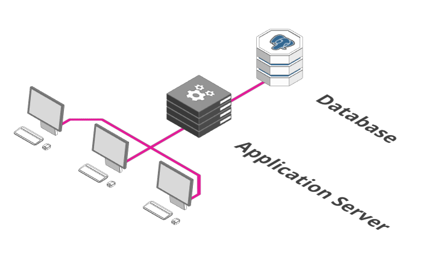
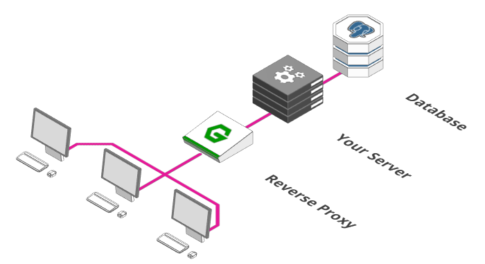
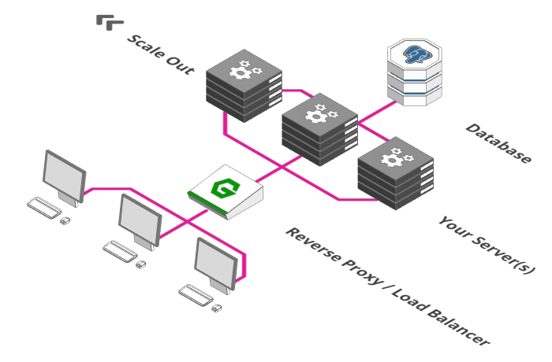
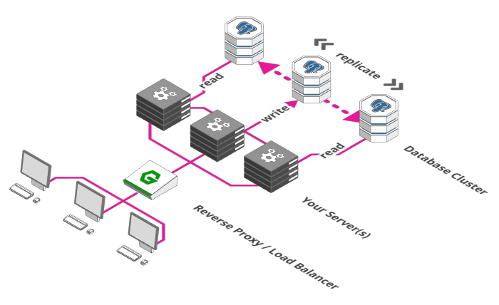
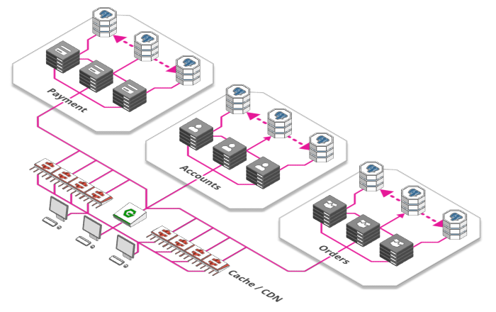
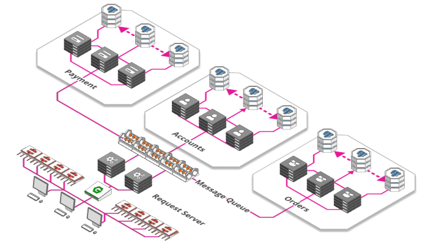
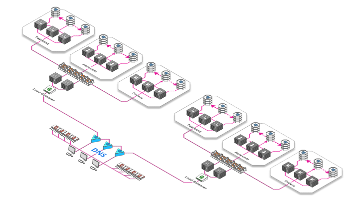

原文地址：https://arcentry.com/blog/scaling-webapps-for-newbs-and-non-techies/
通俗地解释如何拓展网站服务，承受更大的访问量。

# 单个服务器+数据库

这可能是后台刚开始的样子，运行业务逻辑的单个应用程序服务器和长期存储数据的数据库。

# 添加反向代理

网站扩展的第一步是添加反向代理(Reverse Proxy)，代理只是一个接收和转发请求的过程，反向代理设置在我们的主服务器上，将接收到的请求分发到其他服务器或互联网。
反向代理实现了一些功能：
- 健康检查(Health Checks)：确保服务器都在正常运行
- 路由(Routing)：将请求转发到正确的端口
- 身份认证(Authentication)：确保用户是经过允许访问服务器
- 防火墙(Firewalling)：只让用户访问允许访问的部分

# 负载均衡

大多数反向代理服务器还有一个重要的功能：负载均衡器(Load Balancer)。
负载均衡器可以拆分传入的请求，将请求根据某些配置，分散到不同的服务器，避免多用户同时访问同一个服务器造成宕机。

# 扩展数据库

虽然使用负载均衡器可以让我们在多个服务器之间分配负载，但它们都存储和检索来自同一数据库的数据，这样会造成`too many connection`等错误，导致服务器无法访问数据。
扩展数据库需要注意**数据一致性**问题，不一致的数据会导致很多问题：生成多次订单，多次扣款等。如何确保一致性？
我们需要将数据库分成多个部分，一部分负责更新和写入数据，所有其他部分负责检索(读取)数据。我们称之为数据库的主从配置或读写分离。
这样做的好处是保证了数据的一致性，缺点是仍然只有一个数据库负责更新和写入数据，所以数据库还需要扩展。

# 微服务(Microservices)

目前为止，我们的服务还是单独的，整体的，所有的请求都会发送到这个单独的服务中：浏览商品、下单、支付等等。这并不是坏事，单独的服务意味着更低的复杂性，但随着项目规模的扩展，一些问题凸显出来：
- 随着项目开发人员的增加，会有一些意想不到的冲突。
- 当更新服务器上的项目时，网站所有的内容都无法访问
- 一个人的内容完成了，可能其他人未完成的内容也需要一同更新

微服务的出现解决了这些问题：将项目拆分成功能模块，每个模块单独部署。这样刚好解决了上边的问题。

# 缓存和内容交付网络

我们的网站很大一部分是由静态资源组成，如图片、js、css等。只需要在用户首次访问时将这些内容缓存起来，而不是每次访问都请求服务器。

内容交付网络(Content Delivery Network)，一般称之为CDN。CDN的出现使我们可以从最近的CDN服务器请求静态资源，而不是每次都向总总部服务器请求。

# 消息队列(Message Queues)

# 分片(Sharding)

Sharding is a technique of parallelizing an application's stacks by separating them into multiple units, each responsible for a certain key or namespace.
Sharding是一种通过将应用程序的堆栈分成多个单元来并行化应用程序堆栈的技术，每个单元负责某个键或命名空间。
实际上很简单，如果需要为20亿用户提供个人资料，需要将架构分解成26个小型服务，每个服务都为不同首字母的用户提供服务。
Sharding不一定基于字母，但可以基于任意数量的因素，例如位置，使用频率（功率用户被路由到良好的硬件）等等。您可以根据需要以这种方式分割服务器，数据库或堆栈的几乎任何方面。

# 对负载均衡器进行负载均衡(Load-balancing the load-balancer)

即使有功能非常强大的硬件负载均衡器，它们可以处理多少请求也存在硬性限制。
域名系统(Domain Name System)，简称DNS，可以在请求到达负载均衡器之前对请求进行负载均衡。
DNS允许我们为每个域名指定多个IP，每个IP都会导向不同的负载均衡器。
